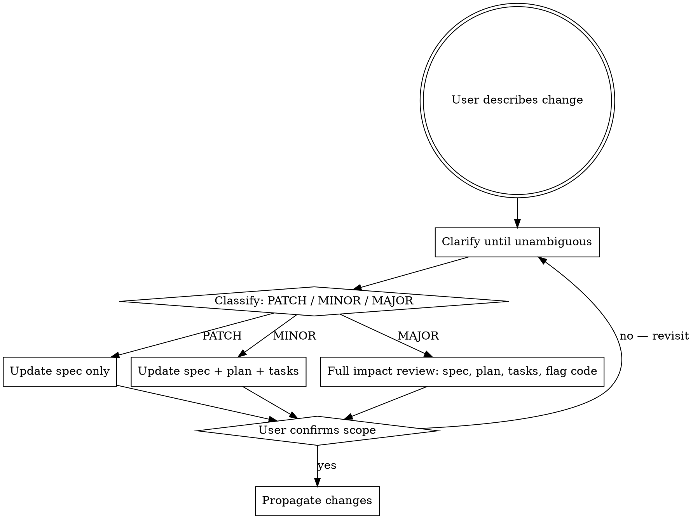

# Plan 006: SDD Update Skill

**Spec:** `docs/specs/006-sdd-update-skill/spec.md`
**Status:** Draft
**Plan Version:** 1.1.0 (added v1.1.0)

---

## Goal

Produce the `sdd-update` skill (SKILL.md + reference.md) and register it in the SDD workflow routing (sdd-workflow/SKILL.md, sdd-workflow/routing.md, CLAUDE.md) so that mid-flight spec changes are always intercepted, classified, versioned, and propagated in the correct artifact order.

---

## Architecture

This is a pure documentation feature. There is no runtime code, no data model, and no API. The deliverables are Markdown files that agents read at skill-invocation time.

**Dependency order:** The skill contract must be defined before content phases, because the content phases expand on the contract's boundaries.

```
Phase 1: Skill contract (name, description, HARD-GATE, when-to-use)
    ↓
Phase 2: Core skill content (SKILL.md — versioning table, flowchart, clarification steps, common mistakes)
    ↓
Phase 3: Detailed reference (reference.md — per-bump procedures, changelog format, resume rules)
    ↓
Phase 4: Workflow integration — sdd-workflow/SKILL.md
    ↓
Phase 5: Full routing update — sdd-workflow/routing.md
    ↓
Phase 6: CLAUDE.md integration
    ↓
Phase 7: Verification — FR coverage check
```

---

## Tech Stack

- Markdown (all deliverables)
- Graphviz `dot` syntax (flowchart in SKILL.md — rendered by the skills framework)
- YAML frontmatter (name, description fields per agentskills.io/specification)

---

## File Structure

| File | Responsibility | Phase |
|------|---------------|-------|
| `skills/sdd-update/SKILL.md` | Invocable skill: contract, versioning table, flowchart, clarification steps, common mistakes, handoff | 1–2 |
| `skills/sdd-update/reference.md` | Full process: per-bump procedures, changelog templates, resume rules | 3 |
| `skills/sdd-workflow/SKILL.md` | Add `sdd-update` row to routing table; add to Common Mistakes | 4 |
| `skills/sdd-workflow/routing.md` | Add `sdd-update` to skill map, priority ordering, mandatory conditions, red flags | 5 |
| `CLAUDE.md` | Add `sdd-update` to skills table, workflow diagram, directory structure | 6 |
| `skills/sdd-update/SKILL.md` | Add Integration section listing `using-git` as required sub-skill (added v1.1.0) | 8 |

---

## Phase 1: Skill Contract

Define the YAML frontmatter and the HARD-GATE block. These are the contract that all downstream content must stay consistent with.

**`skills/sdd-update/SKILL.md` — frontmatter and HARD-GATE:**

```markdown
---
name: sdd-update
description: Use when a user describes a change, addition, or correction to an in-progress feature — after a spec exists but before or during implementation — to assess impact, version the spec, and propagate changes downstream
---

# SDD: Update

**Announce at start:** "I'm using the sdd-update skill to assess and integrate this change."

## Overview

Safely integrate mid-flight changes into a running SDD workflow. Changes are classified by their downstream impact using a spec versioning scheme (MAJOR.MINOR.PATCH), and only the artifacts actually affected are updated. The spec remains the source of truth — all downstream documents derive from it.

<HARD-GATE>
Do NOT update any downstream artifact (plan, tasks, code) until:
1. The change is fully understood — no ambiguity remains
2. A version bump has been assigned and justified
3. The user has explicitly confirmed the impact scope
</HARD-GATE>
```

**Contract rules (derived from FR-1, FR-2, FR-4):**
- Trigger: user describes a change to an already-approved spec
- Blocking conditions: ambiguity, no version bump assigned, no user confirmation
- Exclusions: new features (→ sdd-specify), implementation bugs (→ systematic-debugging)

---

## Phase 2: Core Skill Content (SKILL.md body)

Expand the contract into the full SKILL.md. Every section maps to a Functional Requirement.

**When to Use (FR-1, FR-6):**
```markdown
## When to Use

- User describes a change to an existing, approved spec
- User adds a requirement not captured in the current spec
- User discovers a requirement was wrong, missing, or misunderstood
- User asks "can we also add X?" or "actually, I want Y instead of Z"
- NOT for brand-new features with no existing spec — use `sdd-superpowers:sdd-specify`
- NOT for implementation bugs — use `sdd-superpowers:systematic-debugging`
```

**Spec Versioning Table (FR-2, FR-3):**
```markdown
## Spec Versioning (MAJOR.MINOR.PATCH)

| Bump | Triggers | Downstream Impact |
|------|----------|------------------|
| **PATCH** `0.0.x` | Clarification, wording fix, missing detail, example added — no behavior change | Spec only |
| **MINOR** `0.x.0` | New requirement, new user story, new non-breaking behavior, scope addition | Spec + affected plan phases + affected tasks |
| **MAJOR** `x.0.0` | Removes or rewrites an existing requirement, changes architecture, breaks contracts, contradicts approved design | Spec + full plan review + full task review + flag in-progress code |

Every spec starts at `1.0.0` when approved. Add a `Version:` field to the spec frontmatter.
```

**Flowchart (FR-1, FR-2, FR-4 — decision flow):**


**Clarification steps (FR-1):**
```markdown
## Clarification First

Ask clarifying questions **before classifying** the change. One question at a time:

1. **What specifically changes?** — Old behavior vs. new behavior
2. **Why?** — What user need or discovery drove this?
3. **Does this replace or extend?** — Override an existing requirement, or add alongside it?
4. **Are there constraints?** — Performance, security, compatibility concerns
5. **What's the boundary?** — What explicitly does NOT change?

Stop when the new requirement could be written as a testable acceptance criterion.
```

**Common Mistakes (FR-2, FR-3, FR-4):**
```markdown
## Common Mistakes

- Updating plan/tasks without re-reading the current spec first
- Treating "add X" as always MINOR — sometimes X contradicts an existing requirement (MAJOR)
- Skipping clarification when the change "seems obvious"
- Updating tasks but not the spec — spec is always updated first
- Forgetting to flag in-progress code during a MAJOR bump
```

**Execution Handoff (FR-5):**
```markdown
## Execution Handoff

After propagating changes:

> "Spec updated to vX.Y.Z. [List updated artifacts]. Resuming from [next unaffected task / re-planning needed]. Run `sdd-superpowers:sdd-execute` (or `sdd-superpowers:sdd-plan`) to continue."

See [reference.md](reference.md) for the full classification guide, per-artifact update procedures, spec version header format, and task resume rules.
```

---

## Phase 3: Detailed Reference (reference.md)

Seven steps covering the full process. Each step maps to a Functional Requirement.

**Step 1 — Clarification dialogue (FR-1):**
- Required answers before classifying: old behavior, new/added behavior, replace vs. extend, acceptance criteria
- Stop condition: change expressible as testable acceptance criterion

**Step 2 — Classification (FR-2):**
- PATCH test: "Could a developer who built to the old spec make zero code changes and still pass?" → PATCH
- MINOR test: "Does this require new code without invalidating existing code?" → MINOR
- MAJOR test: "Would a developer need to delete or rewrite existing code?" → MAJOR

**Step 3 — Update spec.md (FR-3):**

Version header format:
```markdown
**Version:** 1.2.0
**Last Updated:** YYYY-MM-DD
```

Changelog block (appended after frontmatter):
```markdown
## Changelog

| Version | Date | Change |
|---------|------|--------|
| 1.0.0 | YYYY-MM-DD | Initial approved spec |
| 1.1.0 | YYYY-MM-DD | Added FR-5: <short description> |
| 2.0.0 | YYYY-MM-DD | Rewrote FR-2: replaced X with Y — <reason> |
```

**Step 4 — Update plan.md — MINOR and MAJOR only (FR-4):**
- MINOR: append phase marked `Phase N (added v1.1.0):`; add Plan Changelog
- MAJOR: mark invalidated phases `~~Phase N~~ (invalidated v2.0.0 — see Phase M)`

**Step 5 — Update tasks.md — MINOR and MAJOR only (FR-4):**

MINOR — new task group:
```markdown
### [NEW v1.1.0] FR-5: <Requirement Name>

- [ ] Write failing test for `<function>`
- [ ] Run `<command>` — expect: FAIL
- [ ] Implement `<function>`
- [ ] Run `<command>` — expect: PASS
- [ ] Commit: `feat: <description>`
```

MAJOR — invalidated completed task:
```markdown
- [x] ~~Implement `old_function`~~ [INVALIDATED v2.0.0 — FR-2 rewritten; see Task Group 7]
```

MAJOR — invalidated incomplete task:
```markdown
- [ ] ~~Write test for `old_function`~~ [INVALIDATED v2.0.0 — skipped]
```

**Step 6 — Flag in-progress code for MAJOR (FR-4):**

Surface before user confirmation:
```
"This MAJOR bump invalidates the following already-implemented behavior:
- src/foo.py — implements old FR-2 (old_function)
- tests/test_foo.py — tests old FR-2 behavior

These will need to be rewritten. Proceed?"
```
Do NOT modify files until user confirms.

**Step 7 — Resume rules (FR-5):**

| Bump | Where to resume |
|------|----------------|
| PATCH | Continue exactly where you left off |
| MINOR | Complete existing tasks first, then execute new task group |
| MAJOR | Stop; re-run `sdd-plan` for affected phases, then `sdd-tasks`, then resume |

---

## Phase 4: sdd-workflow/SKILL.md Integration

**Routing table addition (FR-6):**
Add one row to the Quick Reference table:
```markdown
| **Change or addition to an approved spec** | `sdd-superpowers:sdd-update` |
```
Position: after "Tasks exist" row, before "All tasks complete" row.

**Common Mistakes addition (FR-6):**
```markdown
- Updating tasks or plan without running `sdd-superpowers:sdd-update` when user requests a change — spec must be versioned first
```

---

## Phase 5: sdd-workflow/routing.md Integration

Four additions required (FR-6):

**1. Skill Map entry:**
```markdown
| User describes a change or addition to an approved spec | `sdd-superpowers:sdd-update` |
```

**2. Skill Priority Ordering annotation:**
```markdown
5. `sdd-superpowers:sdd-execute` — actually build it
   - **At any point after spec approval:** `sdd-superpowers:sdd-update` — integrate mid-flight changes before continuing
```

**3. Mandatory conditions block:**
```markdown
**`sdd-superpowers:sdd-update` is mandatory when:**
- User describes a change, addition, or correction to an already-approved spec
- User says "can we also add X", "actually I want Y instead of Z", "I realize we need to change…"
- A mid-implementation discovery invalidates an existing requirement
- Do NOT proceed with plan/tasks/code changes until `sdd-update` has classified the bump and the user has confirmed scope
```

**4. Red flags rows:**
```markdown
| "User said 'also add X' — I'll just update the tasks" | `sdd-superpowers:sdd-update` first — classify impact, update spec, then propagate |
| "This change seems minor, no need to update the spec" | `sdd-superpowers:sdd-update` — even PATCH bumps are recorded in the spec |
```

---

## Phase 6: CLAUDE.md Integration

Three additions required (FR-6):

**1. Skills table row:**
```markdown
| `sdd-update` | Change or addition to an approved spec → classify impact (PATCH/MINOR/MAJOR), version spec, propagate downstream |
```
Position: after `sdd-execute`, before `sdd-review`.

**2. Workflow diagram — add mid-flight branch:**
```
sdd-execute ──────────────────► Implementation with per-task subagents
 │    ▲                          Spec-compliance review after each task
 │    │ (mid-flight change)      Code-quality review after each task
 │  sdd-update ────────────────► classify PATCH/MINOR/MAJOR
 │    │                          version spec, propagate downstream
 │    └── resume execution
```

**3. Directory structure entry:**
```markdown
  sdd-update/             # Mid-flight spec change → PATCH/MINOR/MAJOR versioning + propagation
```
Position: after `sdd-execute/`, before `sdd-review/`.

---

## Phase 7: Verification

After all files are written or updated, verify FR coverage inline:

| FR | Covered by | Verification |
|----|-----------|-------------|
| FR-1: Clarification | SKILL.md §Clarification First, reference.md Step 1 | Read both — all 5 questions present, stop condition stated |
| FR-2: Classification | SKILL.md §Spec Versioning table, reference.md Step 2 | All 3 bump levels defined with trigger test |
| FR-3: Versioning | SKILL.md §Spec Versioning table, reference.md Step 3 | Version header format and Changelog template present |
| FR-4: Propagation | SKILL.md §flowchart, reference.md Steps 4–6 | All 3 bump paths cover spec→plan→tasks→code order |
| FR-5: Resume Rules | reference.md Step 7 | All 3 bump resume conditions defined |
| FR-6: Workflow Integration | sdd-workflow/SKILL.md, routing.md, CLAUDE.md | All 4 routing.md sections updated; CLAUDE.md table, diagram, structure updated |
| FR-7: Sub-skill Integration Registration | skills/sdd-update/SKILL.md §Integration | Integration table present; using-git listed with correct trigger condition |

---

## Phase 8: Sub-skill Integration Registration (added v1.1.0)

Add an Integration section to `skills/sdd-update/SKILL.md` that explicitly lists which bundled support skills sdd-update invokes and when (FR-7).

**Integration section to append before Execution Handoff:**

```markdown
## Integration

Required sub-skills:

| When | Sub-skill |
|------|-----------|
| Committing versioned spec, plan, and tasks after propagation | `sdd-superpowers:using-git` |
```

Position: after Common Mistakes, before Execution Handoff.

---

## Self-Review

**Spec coverage:**
- FR-1 → Phase 2 (Clarification First) + Phase 3 (Step 1) ✅
- FR-2 → Phase 2 (Versioning table) + Phase 3 (Step 2) ✅
- FR-3 → Phase 2 (Versioning table) + Phase 3 (Step 3) ✅
- FR-4 → Phase 2 (flowchart) + Phase 3 (Steps 4–6) ✅
- FR-5 → Phase 3 (Step 7) ✅
- FR-6 → Phases 4, 5, 6 ✅
- FR-7 → Phase 8 (added v1.1.0) ✅

**Placeholder scan:** None found. ✅

**Consistency:** All file paths, skill names (`sdd-superpowers:sdd-update`), and bump labels (PATCH/MINOR/MAJOR) are consistent across all phases. ✅

## Plan Changelog

| Version | Date | Change |
|---------|------|--------|
| 1.0.0 | 2026-04-19 | Initial plan |
| 1.1.0 | 2026-04-19 | Added Phase 8: Sub-skill Integration Registration (FR-7) |
