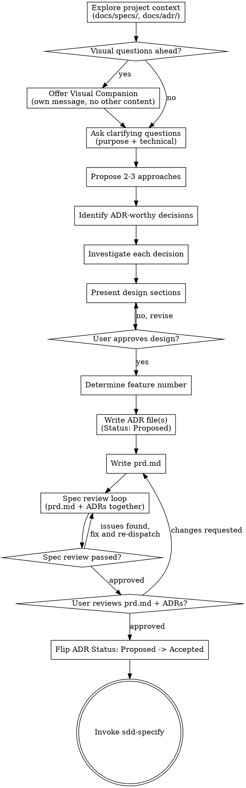

# Merge sdd-brainstorm and sdd-research Implementation Plan

> **For agentic workers:** REQUIRED SUB-SKILL: Use superpowers:subagent-driven-development (recommended) or superpowers:executing-plans to implement this plan task-by-task. Steps use checkbox (`- [ ]`) syntax for tracking.

**Goal:** Merge `sdd-research` into `sdd-brainstorm` so one pre-spec skill covers idea exploration, technical investigation, and formal architecture decisions, replacing `design.md`/`research.md` with `prd.md` + a durable `docs/adr/` log, and updating every downstream consumer.

**Architecture:** `sdd-brainstorm` becomes the sole pre-spec skill. It produces `docs/specs/NNN-<slug>/prd.md` (product-level why/what, no tech matrix) and one `docs/adr/<NNN>-<slug>.md` per significant technical decision (Michael Nygard-style ADR: Status/Context/Options Considered/Decision/Consequences). `sdd-research` is deleted outright. Five consumers (`sdd-workflow`, `sdd-specify`, `sdd-plan`, `sdd-init`, the tech-stack steering file) and four docs (`plugin.json`, `README.md`, `docs/contributing.md`, `CHANGELOG.md`) are updated in the same change so no stale reference survives.

**Tech Stack:** Markdown skill files, YAML frontmatter, `jq` for JSON validation, `grep`/`find` for verification (there is no unit-test framework for skill content — verification substitutes `grep`/`jq` assertions for the "failing test" pattern: each task asserts the old text is gone / new text is present).

**Spec:** `docs/specs/027-merge-brainstorm-research-skill/design.md`

## Global Constraints

- Every `SKILL.md` frontmatter must have `name` + `description` starting with `"Use when..."`, total frontmatter under 1024 chars (`.claude/rules/skill-writing.md`)
- Skill body: exactly one `# Heading`, `##` for sections, `###` for subsections, never skip levels (`.claude/rules/skill-writing.md`, `.claude/rules/markdown-conventions.md`)
- Never reference other skills with `@path/to/file.md` — reference by skill name only, e.g. `sdd-superpowers:sdd-brainstorm` (`.claude/rules/skill-writing.md`)
- All non-root markdown files: `kebab-case.md` (`.claude/rules/markdown-conventions.md`)
- `plugin.json`/`hooks.json` must be valid strict JSON, validated with `jq .` before committing (`.claude/rules/yaml-config.md`)
- `plugin.json` version bump: MAJOR for breaking hook/skill API changes (`.claude/rules/yaml-config.md`) — this change deletes a skill and renames its primary artifact, so `2.12.0` → `3.0.0`
- `skills/sdd-brainstorm/SKILL.md` must keep passing `tests/016-verify-skill-structure.sh`: `<examples>` block with ≥2 `<example>` entries (it's in `PHASE1_SKILLS`), `## Constraints` before `## Error Handling`, the phrase `User requests gate bypass`, under 500 lines
- No placeholders: no "TBD", "TODO", vague "handle appropriately" text in any written file

---

### Task 1: Rewrite `skills/sdd-brainstorm/SKILL.md`

**Files:**
- Modify: `skills/sdd-brainstorm/SKILL.md` (full rewrite)

**Interfaces:**
- Consumes: nothing from other tasks
- Produces: the skill's new artifact names (`prd.md`, `docs/adr/<NNN>-<slug>.md`) that Tasks 2–10 must reference identically; the skill name stays `sdd-brainstorm`

- [ ] **Step 1: Write the failing verification check**

```bash
grep -c "design\.md" skills/sdd-brainstorm/SKILL.md; grep -c "prd\.md" skills/sdd-brainstorm/SKILL.md
```

Expected: first command prints a non-zero count (old artifact name still present), second prints `0` (new artifact name absent) — confirms the file has not yet been rewritten.

- [ ] **Step 2: Run it, confirm the pre-edit state**

Run the two `grep -c` commands above against the current file. Confirm: `design.md` count > 0, `prd.md` count == 0.

- [ ] **Step 3: Replace the file content**

Write `skills/sdd-brainstorm/SKILL.md`:

```markdown
---
name: sdd-brainstorm
description: Use when an idea is fuzzy, exploratory, has competing approaches, or needs a technology/architecture decision investigated before specification
model: opus
effort: high
---

# SDD: Brainstorm

**Announce at start:** "I'm using the sdd-brainstorm skill to explore this idea, investigate options, and decide on an approach before specifying."

## Overview

Turn fuzzy ideas into a validated PRD and formal architecture decisions through collaborative dialogue. Produces `prd.md` (why/what, product-level) and, for each significant technical choice, an ADR at `docs/adr/<NNN>-<slug>.md`. Both feed directly into `sdd-superpowers:sdd-specify` as a fast-path input, skipping questions already answered here.

<examples>
<example>
<context>User says "I'm thinking we might want some kind of notification system — not sure if push, email, or in-app."</context>
<correct>Invoke sdd-brainstorm. The idea has competing approaches and an unresolved technology choice — explore and decide before specifying.</correct>
<incorrect>Jump straight to sdd-specify with "notification system" as the feature — the competing approaches will surface as [NEEDS CLARIFICATION] items that block the spec.</incorrect>
</example>
<example>
<context>User says "I want to add dark mode, it's clear: a CSS variable toggle. Can we just spec it?"</context>
<correct>If the approach is genuinely settled and no technical option needs investigating, go directly to sdd-specify. Brainstorm is for fuzzy ideas or open technical decisions — not every idea needs it.</correct>
<incorrect>Invoke sdd-brainstorm for every idea regardless of fuzziness — clear ideas waste brainstorm overhead and slow delivery.</incorrect>
</example>
</examples>

<HARD-GATE>
Do NOT invoke sdd-specify, sdd-plan, or any implementation skill until the user has approved prd.md and every ADR it links to. Do NOT write code. This skill produces ONLY prd.md and ADR files.
</HARD-GATE>

## When to Use

- The idea is vague, exploratory, or has competing approaches ("I'm thinking about…", "what if we…")
- A technical decision needs investigation before committing — library/framework choice, performance target, security requirement, external integration
- NOT when the idea is already clear and no technical option needs investigating — go straight to `sdd-superpowers:sdd-specify`
- NOT when another brainstorm has already produced `prd.md` — skip to `sdd-superpowers:sdd-specify`

## Quick Reference

Brainstorm outputs two kinds of artifacts:
- `docs/specs/NNN-<feature-slug>/prd.md` — one per feature: the WHY/WHAT
- `docs/adr/<NNN>-<slug>.md` — one per significant technical decision: the HOW and why that option

| Step | Action |
|------|--------|
| 1 | Explore project context; check `docs/specs/` and `docs/adr/` for related work |
| 2 | Ask clarifying questions (one at a time) — purpose, constraints, success criteria, technical requirements |
| 3 | Propose 2-3 approaches with trade-offs + recommendation |
| 4 | Identify which decisions warrant an ADR (hard to reverse, genuinely competing options) |
| 5 | Investigate ADR-worthy decisions; build a decision matrix per decision |
| 6 | Present design in sections, get approval per section |
| 7 | Write ADR file(s) (`Status: Proposed`), then `prd.md` |
| 8 | Spec review loop on `prd.md` + linked ADRs together (max 3 iterations) |
| 9 | User reviews written PRD and ADRs; on approval, flip ADR status to `Accepted` |
| 10 | Invoke `sdd-superpowers:sdd-specify` with the `prd.md` path |

Key principles: one question per message, YAGNI ruthlessly, always 2-3 approaches before settling, decompose multi-subsystem ideas before brainstorming any single piece, only write an ADR for decisions that are hard to reverse or have genuine trade-offs.

**REQUIRED READING before proceeding:** [reference.md](reference.md) — full checklist, process flow diagram, `prd.md` and ADR templates, investigation guides (library/performance/security/integration), spec review loop procedure, and visual companion guide.

## Constraints

- Does NOT invoke sdd-specify, sdd-plan, or any implementation skill until the user has explicitly approved `prd.md` and every linked ADR
- Does NOT write code — this skill produces only `prd.md` and ADR files
- Does NOT produce a spec — `prd.md` and ADRs feed into sdd-specify; they are different artifacts
- Does NOT write an ADR for a trivial or obvious decision — mention it inline in `prd.md` instead

## Error Handling

- **`prd.md` already exists from a prior brainstorm session**: Skip directly to `sdd-superpowers:sdd-specify` fast-path — do not re-run brainstorm.
- **User wants to jump straight to implementation**: Stop. Redirect through sdd-specify → sdd-plan → sdd-execute first; implementation without a spec has no source of truth.
- **A new technical question surfaces after the spec is already written (e.g., during sdd-plan)**: Re-invoke sdd-brainstorm narrowly for that single decision — produce one more ADR, do not block planning entirely on a full re-run.
- **User requests gate bypass**: The gate is "no sdd-specify or implementation before PRD and ADR approval." Explain that without approved decisions, the spec will reflect the first approach considered rather than the best one, and later features will have no record of why this choice was made. Offer to complete the review — it is a short approval step.
```

- [ ] **Step 4: Run the verification check again, confirm it now passes**

```bash
grep -c "design\.md" skills/sdd-brainstorm/SKILL.md; grep -c "prd\.md" skills/sdd-brainstorm/SKILL.md
bash tests/016-verify-skill-structure.sh
```

Expected: first count `0`, second count > `0`. The structure test itself currently exits 1 with 3 pre-existing failures for `session-wrap` (`missing <examples> block`, `missing ## Error Handling section`, `missing 'User requests gate bypass'`) — unrelated to this feature, do not fix them here. Confirm only that no new `[sdd-brainstorm]` FAIL lines appear in the output.

- [ ] **Step 5: Commit**

```bash
git add skills/sdd-brainstorm/SKILL.md
git commit -m "feat(sdd-brainstorm): rewrite SKILL.md for merged brainstorm+research+ADR scope"
```

---

### Task 2: Rewrite `skills/sdd-brainstorm/reference.md`

**Files:**
- Modify: `skills/sdd-brainstorm/reference.md` (full rewrite)

**Interfaces:**
- Consumes: artifact names from Task 1 (`prd.md`, `docs/adr/<NNN>-<slug>.md`)
- Produces: the exact `prd.md` section order (`Problem → Users & Context → Goals → Non-Goals → Success Criteria → Architecture Decisions → Out of Scope`) and ADR section order (`Status/Date/Feature header → Context → Options Considered → Decision → Consequences`) that Task 3's templates, Task 4's reviewer prompt, and Task 7's sdd-specify fast-path validation must all match verbatim

- [ ] **Step 1: Write the failing verification check**

```bash
grep -c "Which Decisions Get an ADR" skills/sdd-brainstorm/reference.md
```

Expected: `0` — the new investigation/ADR-threshold section doesn't exist yet.

- [ ] **Step 2: Run it, confirm it fails (prints 0)**

- [ ] **Step 3: Replace the file content**

Write `skills/sdd-brainstorm/reference.md`:

```markdown
# SDD Brainstorm: Full Process Reference

> Complete brainstorm procedure — idea exploration, technical investigation, ADR and PRD templates, spec review loop, and visual companion guide. See [SKILL.md](SKILL.md) for the summary.

## Step 0: Load Steering Context

Scan `.claude/memory/steering/` for `.md` files whose `loaded-by` frontmatter includes `sdd-brainstorm`. Read each matched file and incorporate its content as context before producing any user-facing output. Loading is silent — no announcement to the user.

If `.claude/memory/steering/` does not exist, or no files contain `sdd-brainstorm` in `loaded-by`, proceed without change.

Rescan on every invocation — custom files added after init are discovered automatically.

## Full Checklist

Complete these in order:

1. **Explore project context** — check `docs/specs/`, `docs/adr/`, docs, recent commits
2. **Offer visual companion** (if topic involves UI/layout questions) — its own message, not combined with a question
3. **Ask clarifying questions** — one at a time; cover purpose/constraints/success criteria AND technical requirements (performance, security, integrations, NFRs)
4. **Propose 2-3 approaches** — with trade-offs and your recommendation
5. **Identify ADR-worthy decisions** — see "Which Decisions Get an ADR" below
6. **Investigate each ADR-worthy decision** — see "Investigating a Decision" below
7. **Present design** — in sections, get user approval after each section
8. **Determine feature number** — scan `docs/specs/` for next available NNN
9. **Write ADR file(s)** — `docs/adr/<NNN>-<slug>.md`, `Status: Proposed`, one per ADR-worthy decision
10. **Write `prd.md`** — save to `docs/specs/NNN-<feature-slug>/prd.md`, linking to each ADR
11. **Spec review loop** — dispatch spec-document-reviewer subagent against `prd.md` and all its linked ADRs together; fix issues and re-dispatch until approved (max 3 iterations, then surface to human)
12. **User reviews `prd.md` and ADRs**
13. **On approval** — flip each new ADR's `Status` from `Proposed` to `Accepted`
14. **Transition** — invoke `sdd-superpowers:sdd-specify` with the `prd.md` path

## Process Flow



**The terminal state is invoking `sdd-superpowers:sdd-specify`.** Do NOT invoke `sdd-superpowers:sdd-plan`, `sdd-superpowers:sdd-execute`, or any other skill. `sdd-superpowers:sdd-specify` is the only next step.

## The Process

### Understanding the idea

- Check `docs/specs/` and `docs/adr/` first — are there existing features or decisions this relates to or overlaps with?
- Before asking detailed questions, assess scope: if the request describes multiple independent subsystems (e.g., "build a platform with auth, billing, and notifications"), flag this immediately and help decompose before brainstorming any single piece.
- If the project is too large, help decompose: what are the independent pieces, how do they relate, what order should they be built? Each piece gets its own `sdd-superpowers:sdd-brainstorm` → `sdd-superpowers:sdd-specify` cycle.
- For appropriately scoped ideas, ask clarifying questions one at a time
- Prefer multiple-choice questions when possible
- Only one question per message
- Focus on: purpose, constraints, success criteria, who the users are, AND technical constraints — performance targets, security/compliance requirements, external integrations

### Exploring approaches

- Propose 2-3 different approaches with trade-offs
- Lead with your recommendation and explain why
- Be concrete — name specific technologies, patterns, or architectural choices where relevant
- YAGNI ruthlessly: remove unrequested features from all proposed approaches

### Which Decisions Get an ADR

A decision warrants its own ADR file when at least one of these is true:

- **Hard to reverse** — migrating away later costs real time (a database, a framework, an auth provider)
- **Genuinely competing options** — real trade-offs exist, not a single obvious answer
- **Durable value** — a later feature will plausibly need to know why this choice was made

Trivial or obvious choices (a dependency already used everywhere in the project, a naming convention, a one-line config default) are mentioned inline in `prd.md`'s narrative — no ADR file. When a decision does NOT rise to ADR level, say so out loud with the reasoning, so the user can override.

### Investigating a Decision

For each ADR-worthy decision, investigate before writing the ADR:

**Library/framework comparisons:**
- List top 2-4 candidates with their trade-offs
- Note: license, maturity, maintenance status, community size
- Note: specific compatibility with the project's existing stack
- Note: performance benchmarks if available
- Make a clear recommendation with rationale

**Performance analysis:**
- Identify the performance-critical path for the feature
- Estimate load characteristics (requests/sec, data volume, concurrency)
- Identify potential bottlenecks before they become problems
- Recommend caching, indexing, or architectural patterns if needed

**Security review:**
- Identify threat vectors relevant to this feature
- Check OWASP guidance for the feature type
- Note authentication/authorization requirements
- Flag data sensitivity and relevant compliance requirements (GDPR, HIPAA, etc.)

**Integration research:**
- Document the external API's constraints (rate limits, auth, data formats)
- Note failure modes and how to handle them
- Identify if an SDK exists vs. raw HTTP needed

**Quality standards for every investigation:**
- **Cite evidence** — "It's popular" is not sufficient; "It has native TypeScript support and we're already using it for X" is
- **Acknowledge uncertainty** — if no reliable benchmark data exists, say so and recommend load testing after implementation
- **Stay grounded in the idea being brainstormed** — don't investigate hypothetical future requirements
- **Avoid analysis paralysis** — list trade-offs but commit to a recommendation for each decision

### Presenting the design

- Once you understand what's being built, present the design in sections
- Scale each section to its complexity
- Ask after each section whether it looks right
- Cover: the core approach, key technical decisions (with your recommendation), what's explicitly out of scope

### Design for isolation and clarity

- Break the system into units with one clear purpose each
- Can someone understand what a unit does without reading its internals?
- Can you change the internals without breaking consumers?
- If not, the boundaries need work

## Writing ADR Files

After the user approves a decision during design presentation:

1. Choose a kebab-case `<slug>` naming the decision topic (e.g. `choose-search-backend`)
2. Create `docs/adr/` if it doesn't exist
3. Write `docs/adr/<NNN>-<slug>.md` using [adr-template.md](adr-template.md), with `Status: Proposed`
4. If this decision supersedes a prior ADR, set the OLD ADR's `Status` to `Superseded by <NNN-slug>` — never delete a prior ADR

`NNN` is the current feature's spec number (same number `prd.md` will use), so an ADR can always be traced back to the feature that produced it. ADRs persist across features — they are not deleted when the originating feature is later changed.

**Structural compliance check (before dispatching the spec reviewer):** Does each ADR contain, in order: header metadata (Status, Date, Feature) → Context → Options Considered → Decision → Consequences?

## Writing the PRD

After all ADRs for this brainstorm are written:

1. Scan `docs/specs/` for the next available feature number (NNN) — reuse the same number used for this session's ADRs
2. Create directory: `docs/specs/NNN-<feature-slug>/`
3. Write `docs/specs/NNN-<feature-slug>/prd.md` using [template.md](template.md), linking to each ADR by path with a one-line summary of what was decided

**Structural compliance check (before dispatching the spec reviewer):** Does the written `prd.md` contain all required sections from `template.md` in order (header metadata → Problem → Users & Context → Goals → Non-Goals → Success Criteria → Architecture Decisions → Out of Scope)? Fix any missing or reordered sections before dispatching the spec-document-reviewer subagent.

## Spec Review Loop

After writing `prd.md` and its ADRs, dispatch the spec-document-reviewer subagent:

See `spec-document-reviewer-prompt.md` in this directory for the dispatch template. One dispatch reviews `prd.md` and ALL of its linked ADRs together, in a single pass.

- If **Issues Found**: fix, re-dispatch, repeat until Approved
- If loop exceeds **3 iterations**: surface to human for guidance — do not keep looping
- If **Approved**: proceed to user review gate

## User Review Gate

After the spec review loop passes:

> "PRD written and saved to `docs/specs/NNN-feature-slug/prd.md`, with N architecture decision(s) recorded in `docs/adr/`. Please review — does this capture what you want to build and how? Any changes before we move to spec?"

Wait for the user's response. If they request changes: update `prd.md` and/or the affected ADR(s), re-run the spec review loop. Only proceed once the user explicitly approves.

On approval, flip each new ADR's `Status` from `Proposed` to `Accepted`.

## Transition to sdd-specify

After user approval:

> "PRD and architecture decisions approved. Invoking `sdd-superpowers:sdd-specify` with `prd.md` as input — it will formalize it into a complete `spec.md` without re-asking the questions we've already answered."

**REQUIRED NEXT SKILL:** Use `sdd-superpowers:sdd-specify`. Pass the path `docs/specs/NNN-<feature-slug>/prd.md`.

## Visual Companion

A browser-based companion for showing mockups, diagrams, and visual options.

**Offering the companion:** When you anticipate visual questions (mockups, layouts, architecture diagrams), offer it once:

> "Some of what we're working on might be easier to explain if I can show it in a browser — mockups, diagrams, layout comparisons. Want to try it? (Requires opening a local URL)"

**This offer MUST be its own message.** Do not combine with clarifying questions or any other content. Wait for the user's response before continuing.

**Per-question decision:** Even after the user accepts, decide FOR EACH QUESTION whether to use the browser or the terminal:
- **Use the browser** for visual content: mockups, wireframes, layout comparisons, architecture diagrams
- **Use the terminal** for text content: requirements questions, conceptual A/B choices, tradeoff lists

If they agree, read `visual-companion.md` in this directory before proceeding.

## Key Principles

- **One question at a time** — never multiple
- **Multiple choice preferred** — easier than open-ended when space is bounded
- **YAGNI ruthlessly** — remove unrequested features from all designs
- **Explore alternatives** — always propose 2-3 approaches before settling
- **Incremental validation** — present design in sections, get approval
- **Scope decomposition first** — never brainstorm a multi-subsystem idea without decomposing
- **ADR discipline** — only a decision that's hard to reverse or genuinely contested gets a durable record; everything else stays inline in the PRD
```

- [ ] **Step 4: Run the verification check again, confirm it now passes**

```bash
grep -c "Which Decisions Get an ADR" skills/sdd-brainstorm/reference.md
```

Expected: count > `0`.

- [ ] **Step 5: Commit**

```bash
git add skills/sdd-brainstorm/reference.md
git commit -m "feat(sdd-brainstorm): rewrite reference.md to fold in research investigation guides and ADR process"
```

---

### Task 3: Replace `template.md`, add `adr-template.md`

**Files:**
- Modify: `skills/sdd-brainstorm/template.md` (was the `design.md` template, becomes the `prd.md` template)
- Create: `skills/sdd-brainstorm/adr-template.md`

**Interfaces:**
- Consumes: section order defined in Task 2 (`prd.md`: Problem → Users & Context → Goals → Non-Goals → Success Criteria → Architecture Decisions → Out of Scope; ADR: Status/Date/Feature → Context → Options Considered → Decision → Consequences)
- Produces: the literal section headings Task 4's reviewer prompt and Task 7's sdd-specify fast-path check must match verbatim

- [ ] **Step 1: Write the failing verification check**

```bash
grep -q "^## Architecture Decisions$" skills/sdd-brainstorm/template.md && echo FOUND || echo MISSING
test -f skills/sdd-brainstorm/adr-template.md && echo FOUND || echo MISSING
```

Expected: both print `MISSING`.

- [ ] **Step 2: Run it, confirm both print MISSING**

- [ ] **Step 3: Write both files**

Replace `skills/sdd-brainstorm/template.md`:

```markdown
# PRD: <Feature Name>

**Date:** YYYY-MM-DD
**Feature:** NNN-<feature-slug>

## Problem

<What problem this solves and who experiences it.>

## Users & Context

<Who the users are, what they're trying to accomplish, and what existing systems this touches.>

## Goals

<What this feature must achieve, as a list.>

## Non-Goals

<What this feature explicitly will NOT do, as a list.>

## Success Criteria

<How we'll know this worked — observable outcomes, not implementation details.>

## Architecture Decisions

<One line per decision, linking to its ADR file.>

- [<Decision title>](../../adr/NNN-<slug>.md) — <one-line summary of what was decided and why>

## Out of Scope

<What was explicitly discussed and excluded.>
```

Create `skills/sdd-brainstorm/adr-template.md`:

```markdown
# ADR-<NNN>-<slug>: <Decision Title>

**Status:** Proposed
**Date:** YYYY-MM-DD
**Feature:** NNN-<feature-slug>

## Context

<The forces at play — the problem needing a technical decision, and the constraints or requirements from the PRD that bear on it.>

## Options Considered

### Option A: <Name>

**Pros:** <list>
**Cons:** <list>

### Option B: <Name>

**Pros:** <list>
**Cons:** <list>

## Decision

**We chose <Option X>** because <specific rationale tied to a requirement in the PRD — not just opinion>.

## Consequences

<What becomes easier or harder as a result of this decision. What would need to be revisited if this ADR is later superseded.>
```

- [ ] **Step 4: Run the verification check again, confirm it now passes**

```bash
grep -q "^## Architecture Decisions$" skills/sdd-brainstorm/template.md && echo FOUND || echo MISSING
test -f skills/sdd-brainstorm/adr-template.md && echo FOUND || echo MISSING
```

Expected: both print `FOUND`.

- [ ] **Step 5: Commit**

```bash
git add skills/sdd-brainstorm/template.md skills/sdd-brainstorm/adr-template.md
git commit -m "feat(sdd-brainstorm): add prd.md and adr.md canonical templates"
```

---

### Task 4: Rewrite `skills/sdd-brainstorm/spec-document-reviewer-prompt.md`

**Files:**
- Modify: `skills/sdd-brainstorm/spec-document-reviewer-prompt.md` (full rewrite)

**Interfaces:**
- Consumes: `prd.md` and ADR section lists from Task 3
- Produces: nothing consumed by later tasks

- [ ] **Step 1: Write the failing verification check**

```bash
grep -c "PRD_FILE_PATH" skills/sdd-brainstorm/spec-document-reviewer-prompt.md
```

Expected: `0`.

- [ ] **Step 2: Run it, confirm it prints 0**

- [ ] **Step 3: Replace the file content**

```markdown
# Spec Document Reviewer Prompt Template

Use this template when dispatching a spec-document-reviewer subagent after writing `prd.md` and its ADR(s).

**Purpose:** Verify the PRD and its architecture decisions are complete, consistent, and ready to be formalized into a spec by `sdd-superpowers:sdd-specify`.

**Dispatch after:** `prd.md` is written to `docs/specs/NNN-<feature-slug>/prd.md` and all its linked ADRs exist under `docs/adr/`.

```
Task tool (general-purpose):
  description: "Review SDD PRD and architecture decisions"
  prompt: |
    You are a spec document reviewer for an SDD (Specification-Driven Development) project.
    Verify this PRD and its architecture decisions are complete and ready to be passed to sdd-specify for formalization.

    **PRD to review:** [PRD_FILE_PATH]
    **Linked ADRs to review:** [ADR_FILE_PATHS]

    ## What to Check

    | Category | What to Look For |
    |----------|-----------------|
    | Completeness | TODOs, placeholders, "TBD", empty sections, missing required sections |
    | Consistency | Internal contradictions, conflicting decisions, an ADR that contradicts the PRD's goals |
    | Clarity | Statements ambiguous enough to cause sdd-specify to ask clarifying questions |
    | Scope | Single coherent feature — not spanning multiple independent subsystems |
    | YAGNI | Unrequested features, over-engineering, "might need later" additions |
    | ADR quality | Does each ADR's Decision cite a specific reason tied to the PRD, not just opinion? Are Options Considered genuinely distinct? |
    | ADR necessity | Does every ADR represent a decision that's hard to reverse or genuinely contested — not a trivial choice that should have stayed inline in the PRD? |

    ## Required Sections

    The PRD must contain ALL of these sections with non-empty content, in order:
    - Problem
    - Users & Context
    - Goals
    - Non-Goals
    - Success Criteria
    - Architecture Decisions (linking to every ADR reviewed alongside it)
    - Out of Scope

    Each ADR must contain ALL of these sections with non-empty content, in order:
    - Status / Date / Feature (header metadata)
    - Context
    - Options Considered (at least two options)
    - Decision
    - Consequences

    ## Calibration

    **Only flag issues that would cause real problems when sdd-specify tries to formalize this into a spec.**
    A missing section, a contradiction, a PRD or ADR so vague that sdd-specify would need to re-ask the
    same questions we already answered in brainstorming — those are issues.

    Minor wording improvements, stylistic preferences, and "could be more detailed" are not issues.

    Approve unless there are serious gaps.

    ## Output Format

    ## PRD + ADR Review

    **Status:** Approved | Issues Found

    **Issues (if any):**
    - [Document — PRD or ADR filename][Section]: [specific issue] — [why it matters for sdd-specify formalization]

    **Recommendations (advisory, do not block approval):**
    - [suggestions for improvement]
```

**Reviewer returns:** Status, Issues (if any), Recommendations
```

- [ ] **Step 4: Run the verification check again, confirm it now passes**

```bash
grep -c "PRD_FILE_PATH" skills/sdd-brainstorm/spec-document-reviewer-prompt.md
```

Expected: count > `0`.

- [ ] **Step 5: Commit**

```bash
git add skills/sdd-brainstorm/spec-document-reviewer-prompt.md
git commit -m "feat(sdd-brainstorm): update reviewer prompt to check prd.md plus linked ADRs together"
```

---

### Task 5: Delete `skills/sdd-research/`

**Files:**
- Delete: `skills/sdd-research/SKILL.md`
- Delete: `skills/sdd-research/reference.md`
- Delete: `skills/sdd-research/template.md`

**Interfaces:**
- Consumes: nothing (Task 2 already absorbed the content this directory held)
- Produces: nothing

- [ ] **Step 1: Write the failing verification check**

```bash
test -d skills/sdd-research && echo EXISTS || echo GONE
```

Expected: `EXISTS`.

- [ ] **Step 2: Run it, confirm it prints EXISTS**

- [ ] **Step 3: Delete the directory**

```bash
git rm -r skills/sdd-research
```

- [ ] **Step 4: Run the verification check again, confirm it now passes**

```bash
test -d skills/sdd-research && echo EXISTS || echo GONE
```

Expected: `GONE`.

- [ ] **Step 5: Commit**

```bash
git commit -m "feat(sdd-research): remove skill directory, fully absorbed into sdd-brainstorm"
```

---

### Task 6: Update `sdd-workflow` routing

**Files:**
- Modify: `skills/sdd-workflow/SKILL.md`
- Modify: `skills/sdd-workflow/routing.md`

**Interfaces:**
- Consumes: `sdd-brainstorm` scope from Task 1
- Produces: nothing consumed by later tasks

- [ ] **Step 1: Write the failing verification check**

```bash
grep -c "sdd-research" skills/sdd-workflow/SKILL.md skills/sdd-workflow/routing.md
```

Expected: both files report a count > `0`.

- [ ] **Step 2: Run it, confirm both counts are > 0**

- [ ] **Step 3: Edit both files**

In `skills/sdd-workflow/SKILL.md`, in the Quick Reference table:

Remove this row:
```
| Unresolved tech choices | `sdd-superpowers:sdd-research` |
```

Change:
```
| Fuzzy or exploratory idea | `sdd-superpowers:sdd-brainstorm` |
```
to:
```
| Fuzzy or exploratory idea, or unresolved technical/architecture decision | `sdd-superpowers:sdd-brainstorm` |
```

In `skills/sdd-workflow/routing.md`:

In the "SDD Skill Map (Full)" table, remove:
```
| Need to investigate tech options before committing | `sdd-superpowers:sdd-research` |
```
and change:
```
| Idea is fuzzy, exploratory, or has competing approaches | `sdd-superpowers:sdd-brainstorm` |
```
to:
```
| Idea is fuzzy, exploratory, has competing approaches, or needs a technical decision investigated | `sdd-superpowers:sdd-brainstorm` |
```

Replace the "Skill Priority Ordering" list:
```
1. `sdd-superpowers:sdd-brainstorm` (optional) → `sdd-superpowers:sdd-specify` — establish WHAT to build
2. `sdd-superpowers:sdd-research` (optional) — investigate HOW before committing
3. `sdd-superpowers:sdd-plan` — establish the technical approach
4. `sdd-superpowers:sdd-execute` — actually build it
   - **At any point after spec approval:** `sdd-superpowers:sdd-spec-update` — integrate mid-flight changes before continuing
6. `sdd-superpowers:sdd-review` + `sdd-superpowers:verification-before-completion` — confirm it was built correctly
```
with:
```
1. `sdd-superpowers:sdd-brainstorm` (optional) — establish WHAT to build and decide HOW via ADRs
2. `sdd-superpowers:sdd-plan` — establish the technical approach
3. `sdd-superpowers:sdd-execute` — actually build it
   - **At any point after spec approval:** `sdd-superpowers:sdd-spec-update` — integrate mid-flight changes before continuing
4. `sdd-superpowers:sdd-review` + `sdd-superpowers:verification-before-completion` — confirm it was built correctly
```

In the "When Each Skill Is Mandatory" section, replace:
```
**`sdd-superpowers:sdd-brainstorm` is mandatory when:**
- User explicitly asks to brainstorm or explore
- (Advisory) Auto-detected fuzziness signals present and user chooses brainstorm path

**`sdd-superpowers:sdd-specify` is mandatory when:**
- Idea is clear and concrete, OR
- `sdd-superpowers:sdd-brainstorm` has completed and `design.md` exists

**`sdd-superpowers:sdd-research` is mandatory when:**
- Spec has `[NEEDS CLARIFICATION]` items requiring technical investigation
- Non-functional requirements need validation (performance, security)
- Multiple viable technology paths exist
```
with:
```
**`sdd-superpowers:sdd-brainstorm` is mandatory when:**
- User explicitly asks to brainstorm or explore
- (Advisory) Auto-detected fuzziness signals present and user chooses brainstorm path
- A technical decision needs investigation before committing — non-functional requirements to validate (performance, security), or multiple viable technology paths

**`sdd-superpowers:sdd-specify` is mandatory when:**
- Idea is clear and concrete, OR
- `sdd-superpowers:sdd-brainstorm` has completed and `prd.md` exists
```

- [ ] **Step 4: Run the verification check again, confirm it now passes**

```bash
grep -c "sdd-research" skills/sdd-workflow/SKILL.md skills/sdd-workflow/routing.md
```

Expected: both counts `0`.

- [ ] **Step 5: Commit**

```bash
git add skills/sdd-workflow/SKILL.md skills/sdd-workflow/routing.md
git commit -m "feat(sdd-workflow): drop sdd-research routing, merge its mandatory conditions into sdd-brainstorm"
```

---

### Task 7: Update `sdd-specify`

**Files:**
- Modify: `skills/sdd-specify/SKILL.md`
- Modify: `skills/sdd-specify/reference.md`

**Interfaces:**
- Consumes: `prd.md` section order from Task 3 (`Problem → Users & Context → Goals → Non-Goals → Success Criteria → Architecture Decisions → Out of Scope`)
- Produces: nothing consumed by later tasks

- [ ] **Step 1: Write the failing verification check**

```bash
grep -c "design\.md\|sdd-research" skills/sdd-specify/SKILL.md skills/sdd-specify/reference.md
```

Expected: both files report a count > `0`.

- [ ] **Step 2: Run it, confirm both counts are > 0**

- [ ] **Step 3: Edit both files**

In `skills/sdd-specify/SKILL.md`:

Change the Overview line:
```
Turn ideas into precise, executable Product Requirements Documents (PRDs). The specification is the source of truth — code serves specs, not the other way around. A spec written here drives all downstream planning and code generation.
```
to:
```
Turn ideas (or an approved PRD from `sdd-superpowers:sdd-brainstorm`) into a precise, executable specification. The specification is the source of truth — code serves specs, not the other way around. A spec written here drives all downstream planning and code generation.
```

Change the "When to Use" bullets:
```
- A new feature, idea, or problem needs to be formalized
- `sdd-superpowers:sdd-brainstorm` has completed and `design.md` exists (fast-path)
- NOT when spec already exists — go to `sdd-superpowers:sdd-plan` or `sdd-superpowers:sdd-research`
- NOT when the idea is still fuzzy — run `sdd-superpowers:sdd-brainstorm` first
```
to:
```
- A new feature, idea, or problem needs to be formalized
- `sdd-superpowers:sdd-brainstorm` has completed and `prd.md` exists (fast-path)
- NOT when spec already exists — go to `sdd-superpowers:sdd-plan`
- NOT when the idea is still fuzzy — run `sdd-superpowers:sdd-brainstorm` first
```

Change:
```
**Fast-path:** if `design.md` exists from `sdd-superpowers:sdd-brainstorm`, Steps 2–3 are skipped — the design is formalized directly.
```
to:
```
**Fast-path:** if `prd.md` exists from `sdd-superpowers:sdd-brainstorm`, Steps 2–3 are skipped — the PRD is formalized directly.
```

Change the Constraints bullet:
```
- Does NOT proceed to sdd-plan, sdd-research, or any downstream skill before the spec is explicitly approved
```
to:
```
- Does NOT proceed to sdd-plan or any downstream skill before the spec is explicitly approved
```

In `skills/sdd-specify/reference.md`:

Change Step 1's fast-path detection:
```
4. **Fast-path detection:** Check if `docs/specs/NNN-<feature-slug>/design.md` exists (produced by `sdd-superpowers:sdd-brainstorm`)
   - If YES → validate the design doc:
     - Does it contain all required sections: **Problem**, **Chosen Approach**, **Trade-offs & Rationale**, **Key Design Decisions**, **Out of Scope**?
     - Is each section non-empty?
     - If **valid** → skip Steps 2 and 3 entirely. Read `design.md`, extract each section, formalize directly into `spec.md`. Jump to Step 4.
     - If **invalid** → warn the user: *"Found design.md but it appears incomplete. Proceeding with normal spec dialogue."* Continue with Steps 2–3.
   - If NO → normal path: proceed with Steps 2 and 3 as usual.
```
to:
```
4. **Fast-path detection:** Check if `docs/specs/NNN-<feature-slug>/prd.md` exists (produced by `sdd-superpowers:sdd-brainstorm`)
   - If YES → validate the PRD and its linked ADRs:
     - Does `prd.md` contain all required sections: **Problem**, **Users & Context**, **Goals**, **Non-Goals**, **Success Criteria**, **Architecture Decisions**, **Out of Scope**?
     - Does every ADR linked from "Architecture Decisions" exist under `docs/adr/` with `Status: Accepted`?
     - Is each section non-empty?
     - If **valid** → skip Steps 2 and 3 entirely. Read `prd.md` and its linked ADRs, extract each section, formalize directly into `spec.md`. Jump to Step 4.
     - If **invalid** → warn the user: *"Found prd.md but it appears incomplete. Proceeding with normal spec dialogue."* Continue with Steps 2–3.
   - If NO → normal path: proceed with Steps 2 and 3 as usual.
```

Change the Step 8 Handoff block:
```
> "Specification complete and saved to `docs/specs/NNN-feature-slug/spec.md` on branch `NNN-feature-slug`.
>
> **Option A — Research first (recommended for complex features):**
> Use `sdd-superpowers:sdd-research` to investigate technology options, performance implications, and constraints before planning.
>
> **Option B — Review the spec first:**
> Use `sdd-superpowers:sdd-review` (spec mode) for an independent completeness check before planning.
>
> **Option C — Plan directly:**
> Use `sdd-superpowers:sdd-plan` to create the implementation plan from this spec.
>
> Which would you like?"
```
to:
```
> "Specification complete and saved to `docs/specs/NNN-feature-slug/spec.md` on branch `NNN-feature-slug`.
>
> **Option A — Review the spec first:**
> Use `sdd-superpowers:sdd-review` (spec mode) for an independent completeness check before planning.
>
> **Option B — Plan directly:**
> Use `sdd-superpowers:sdd-plan` to create the implementation plan from this spec.
>
> Which would you like?"
```

- [ ] **Step 4: Run the verification check again, confirm it now passes**

```bash
grep -c "design\.md\|sdd-research" skills/sdd-specify/SKILL.md skills/sdd-specify/reference.md
```

Expected: both counts `0`.

- [ ] **Step 5: Commit**

```bash
git add skills/sdd-specify/SKILL.md skills/sdd-specify/reference.md
git commit -m "feat(sdd-specify): fast-path on prd.md + ADRs instead of design.md, drop sdd-research handoff option"
```

---

### Task 8: Update `sdd-plan`

**Files:**
- Modify: `skills/sdd-plan/SKILL.md`

**Interfaces:**
- Consumes: `sdd-brainstorm`'s ADR re-entry error handling from Task 1
- Produces: nothing consumed by later tasks

- [ ] **Step 1: Write the failing verification check**

```bash
grep -c "research\.md" skills/sdd-plan/SKILL.md
```

Expected: count > `0`.

- [ ] **Step 2: Run it, confirm it's > 0**

- [ ] **Step 3: Edit the file**

Change the "When to Use" bullet:
```
- Optionally: `research.md` exists with tech investigation results
```
to:
```
- Optionally: one or more `docs/adr/<NNN>-*.md` files exist with technical decisions for this feature
```

Change the Error Handling bullet:
```
- **research.md is recommended but missing for a feature with unresolved tech choices**: Offer to run sdd-research first; note that planning without research may require plan revision.
```
to:
```
- **No ADR exists for a feature with unresolved tech choices**: Offer to invoke `sdd-superpowers:sdd-brainstorm` narrowly to produce the missing ADR first; note that planning without it may require plan revision.
```

- [ ] **Step 4: Run the verification check again, confirm it now passes**

```bash
grep -c "research\.md" skills/sdd-plan/SKILL.md
```

Expected: `0`.

- [ ] **Step 5: Commit**

```bash
git add skills/sdd-plan/SKILL.md
git commit -m "feat(sdd-plan): reference ADRs instead of research.md for pre-plan tech decisions"
```

---

### Task 9: Update `sdd-init` and the tech-stack steering file

**Files:**
- Modify: `skills/sdd-init/SKILL.md`
- Modify: `skills/sdd-init/reference.md`
- Modify: `.claude/memory/steering/tech-stack.md`

**Interfaces:**
- Consumes: `sdd-brainstorm` as the new steering consumer (Task 1)
- Produces: nothing consumed by later tasks

- [ ] **Step 1: Write the failing verification check**

```bash
grep -c "sdd-research" skills/sdd-init/SKILL.md skills/sdd-init/reference.md .claude/memory/steering/tech-stack.md
```

Expected: all three files report a count > `0`.

- [ ] **Step 2: Run it, confirm all three are > 0**

- [ ] **Step 3: Edit all three files**

In `skills/sdd-init/SKILL.md`, change:
```
| `.claude/memory/steering/tech-stack.md` | Tech stack context — loaded by sdd-specify, sdd-plan, sdd-execute, sdd-research, sdd-review |
```
to:
```
| `.claude/memory/steering/tech-stack.md` | Tech stack context — loaded by sdd-brainstorm, sdd-specify, sdd-plan, sdd-execute, sdd-review |
```

In `skills/sdd-init/reference.md`, change:
```
loaded-by: sdd-specify, sdd-plan, sdd-execute, sdd-research, sdd-review
```
to:
```
loaded-by: sdd-brainstorm, sdd-specify, sdd-plan, sdd-execute, sdd-review
```

In `.claude/memory/steering/tech-stack.md`, change its frontmatter:
```
loaded-by: sdd-specify, sdd-plan, sdd-execute, sdd-research, sdd-review
```
to:
```
loaded-by: sdd-brainstorm, sdd-specify, sdd-plan, sdd-execute, sdd-review
```

- [ ] **Step 4: Run the verification check again, confirm it now passes**

```bash
grep -c "sdd-research" skills/sdd-init/SKILL.md skills/sdd-init/reference.md .claude/memory/steering/tech-stack.md
```

Expected: all three counts `0`.

- [ ] **Step 5: Commit**

```bash
git add skills/sdd-init/SKILL.md skills/sdd-init/reference.md .claude/memory/steering/tech-stack.md
git commit -m "feat(sdd-init): swap sdd-research for sdd-brainstorm in tech-stack steering loaded-by list"
```

---

### Task 10: Update `plugin.json`, `README.md`, `docs/contributing.md`, `CHANGELOG.md`

**Files:**
- Modify: `.claude-plugin/plugin.json`
- Modify: `README.md`
- Modify: `docs/contributing.md`
- Modify: `CHANGELOG.md`

**Interfaces:**
- Consumes: final artifact names and skill list from Tasks 1–9
- Produces: nothing consumed by later tasks

- [ ] **Step 1: Write the failing verification check**

```bash
jq -r '.version' .claude-plugin/plugin.json
grep -c "sdd-research\|design\.md\|research\.md" README.md docs/contributing.md
```

Expected: version prints `2.12.0`; both grep counts are > `0`.

- [ ] **Step 2: Run it, confirm the pre-edit state**

- [ ] **Step 3: Edit all four files**

In `.claude-plugin/plugin.json`, change:
```json
  "description": "Specification-Driven Development (SDD) for Claude Code: write specs first, generate code from them. Workflow covering brainstorm → specify → research → plan → execute → sdd-spec-update → review.",
  "version": "2.12.0",
```
to:
```json
  "description": "Specification-Driven Development (SDD) for Claude Code: write specs first, generate code from them. Workflow covering brainstorm (with research + ADRs) → specify → plan → execute → sdd-spec-update → review.",
  "version": "3.0.0",
```

In `README.md`:

Change:
```
- **Specifications as lingua franca** — PRD and implementation plan are the primary artifacts
```
to:
```
- **Specifications as lingua franca** — PRD, specification, and implementation plan are the primary artifacts
```

In the Skills table, remove:
```
| `sdd-research` | Unresolved tech choices, performance/security requirements before planning |
```
and change:
```
| `sdd-brainstorm` | Idea is fuzzy/exploratory → dialogue + 2-3 approaches + design.md |
| `sdd-specify` | Idea is clear, or design.md exists → structured PRD (spec.md) |
```
to:
```
| `sdd-brainstorm` | Idea is fuzzy/exploratory, or a technical decision needs investigating → dialogue + 2-3 approaches + prd.md + docs/adr/ |
| `sdd-specify` | Idea is clear, or prd.md exists → structured specification (spec.md) |
```

In the Workflow diagram, change:
```
sdd-brainstorm ──────────────────┤
 │  dialogue + 2-3 approaches    │
 │  design.md + spec-review      │
 │                               │
 └───────────────────────────────┘
                                 │
                                 ▼
sdd-specify ──────────────────► docs/specs/NNN-feature/spec.md
                                 + feature branch created
```
to:
```
sdd-brainstorm ──────────────────┤
 │  dialogue + 2-3 approaches    │
 │  prd.md + docs/adr/*.md       │
 │  + spec-review                │
 │                               │
 └───────────────────────────────┘
                                 │
                                 ▼
sdd-specify ──────────────────► docs/specs/NNN-feature/spec.md
                                 + feature branch created
```

In the Quick Start section, change:
```
# Fuzzy idea path:
# 1. Invoke sdd-brainstorm with your idea
# 2. Answer questions, pick from 2-3 approaches, approve design
# 3. sdd-brainstorm automatically invokes sdd-specify (fast-path)
```
to:
```
# Fuzzy idea path:
# 1. Invoke sdd-brainstorm with your idea
# 2. Answer questions, pick from 2-3 approaches, approve the PRD and any ADRs
# 3. sdd-brainstorm automatically invokes sdd-specify (fast-path)
```

In `docs/contributing.md`:

Change the lingua-franca bullet:
```
- **Specifications as lingua franca** — PRD and implementation plan are the primary artifacts
```
to:
```
- **Specifications as lingua franca** — PRD, specification, and implementation plan are the primary artifacts
```

Change the Skills table rows:
```
| `sdd-brainstorm` | Idea is fuzzy/exploratory → dialogue + 2-3 approaches + design.md |
| `sdd-specify` | Idea is clear, or design.md exists → structured PRD (spec.md) |
| `sdd-research` | Unresolved tech choices, performance/security requirements before planning |
```
to:
```
| `sdd-brainstorm` | Idea is fuzzy/exploratory, or a technical decision needs investigating → dialogue + 2-3 approaches + prd.md + docs/adr/ |
| `sdd-specify` | Idea is clear, or prd.md exists → structured specification (spec.md) |
```

Change the Workflow diagram — this diagram has a fast-path annotation and a research branch that README's diagram does not, so replace the whole block:
```
sdd-brainstorm ──────────────────┤
 │  dialogue + 2-3 approaches    │
 │  design.md + spec-review      │
 │                               │
 └───────────────────────────────┘
                                 │
                                 ▼
sdd-specify ──────────────────► docs/specs/NNN-feature/spec.md
 │  (fast-path if design.md       + feature branch created
 │   already exists)
 │
 ├─(complex features)──────────►
 │                              sdd-research ──► docs/specs/NNN-feature/research.md
 │ ◄────────────────────────────┘
 │
 ├─(optional pre-plan check)───►
 │                              sdd-review (spec mode)
 │ ◄────────────────────────────┘
 │
 ▼
```
with:
```
sdd-brainstorm ──────────────────┤
 │  dialogue + 2-3 approaches    │
 │  prd.md + docs/adr/*.md       │
 │  + spec-review                │
 │                               │
 └───────────────────────────────┘
                                 │
                                 ▼
sdd-specify ──────────────────► docs/specs/NNN-feature/spec.md
 │  (fast-path if prd.md          + feature branch created
 │   already exists)
 │
 ├─(optional pre-plan check)───►
 │                              sdd-review (spec mode)
 │ ◄────────────────────────────┘
 │
 ▼
```

Change:
```
      spec.md          # PRD — the source of truth
      research.md      # Technical investigation (optional)
```
to:
```
      prd.md           # Pre-spec product framing + links to ADRs (optional, from sdd-brainstorm)
      spec.md          # Specification — the source of truth
```

Change:
```
skills/
  sdd-workflow/
  sdd-brainstorm/
  sdd-specify/
  sdd-research/
  sdd-plan/
```
to:
```
skills/
  sdd-workflow/
  sdd-brainstorm/
  sdd-specify/
  sdd-plan/
```

Change the Quick Start step:
```
1. "Use sdd-brainstorm to explore: [your idea]"
2. Answer questions, pick from 2-3 approaches, approve design
3. sdd-brainstorm automatically invokes sdd-specify (fast-path)
```
to:
```
1. "Use sdd-brainstorm to explore: [your idea]"
2. Answer questions, pick from 2-3 approaches, approve the PRD and any ADRs
3. sdd-brainstorm automatically invokes sdd-specify (fast-path)
```

In `CHANGELOG.md`, add a new top entry (leave all existing entries untouched):

```markdown
## [3.0.0] - 2026-08-15

### Changed

- **BREAKING: merged `sdd-research` into `sdd-brainstorm`** — one pre-spec skill now covers idea exploration, technical investigation, and formal architecture decisions. `design.md` and `research.md` are replaced by `prd.md` (product-level why/what) and a durable `docs/adr/<NNN>-<slug>.md` log (one file per significant technical decision, Michael Nygard ADR format: Status/Context/Options Considered/Decision/Consequences). `sdd-research` skill directory removed; `sdd-workflow`, `sdd-specify`, `sdd-plan`, `sdd-init`, and the `tech-stack.md` steering file updated to the new routing and artifact names. Existing `design.md`/`research.md` files from features brainstormed before this change are left as-is — this is forward-only, not migrated.

---
```

- [ ] **Step 4: Run the verification check again, confirm it now passes**

```bash
jq -r '.version' .claude-plugin/plugin.json
jq . .claude-plugin/plugin.json > /dev/null && echo "valid json"
grep -c "sdd-research\|design\.md\|research\.md" README.md docs/contributing.md
```

Expected: version prints `3.0.0`; `valid json` prints; both grep counts `0`.

- [ ] **Step 5: Commit**

```bash
git add .claude-plugin/plugin.json README.md docs/contributing.md CHANGELOG.md
git commit -m "docs: bump plugin to 3.0.0, update README/contributing/changelog for merged sdd-brainstorm"
```

---

### Task 11: Full verification sweep

**Files:** none (verification only)

**Interfaces:**
- Consumes: the complete state of Tasks 1–10
- Produces: final confirmation the feature is complete

- [ ] **Step 1: Confirm no stale references anywhere**

```bash
grep -rn "sdd-research" --include="*.md" --include="*.json" . | grep -v "docs/specs/0[0-2][0-9]-" || echo "CLEAN"
```

Expected: `CLEAN` (the only remaining `sdd-research` mentions are inside historical `docs/specs/NNN-*` files from past features, which are intentionally untouched).

- [ ] **Step 2: Confirm skill structure tests still pass**

```bash
bash tests/016-verify-skill-structure.sh
```

Expected: still exits 1 with the same 3 pre-existing `[session-wrap]` failures seen before this feature started (confirmed by running the script prior to any edits: `TOTAL: 3 failure(s)`, skill count `20` directories excluding `writing-skills`). No new `[sdd-brainstorm]` or `[sdd-research]` FAIL lines should appear. Do NOT fix the `session-wrap` failures as part of this task — they're pre-existing and out of scope; flag them to the user as a separate finding rather than silently leaving them or silently fixing them.

- [ ] **Step 3: Confirm plugin.json is valid JSON with the new version**

```bash
jq . .claude-plugin/plugin.json
```

Expected: prints the full parsed JSON with `"version": "3.0.0"`.

- [ ] **Step 4: Confirm the new directory layout exists**

```bash
ls skills/sdd-brainstorm/
test -d skills/sdd-research && echo "STILL EXISTS - BUG" || echo "correctly removed"
```

Expected: `skills/sdd-brainstorm/` lists `SKILL.md reference.md template.md adr-template.md spec-document-reviewer-prompt.md visual-companion.md scripts/`; second command prints `correctly removed`.

- [ ] **Step 5: Report results to the user**

Summarize: files changed, deleted, created; verification output; the one open finding from Step 2 if the skill count is stale. Do not claim the feature is done without having actually run Steps 1–4 in this session (per `sdd-superpowers:verification-before-completion` / this project's "NO COMPLETION CLAIM without fresh verification evidence" gate).
