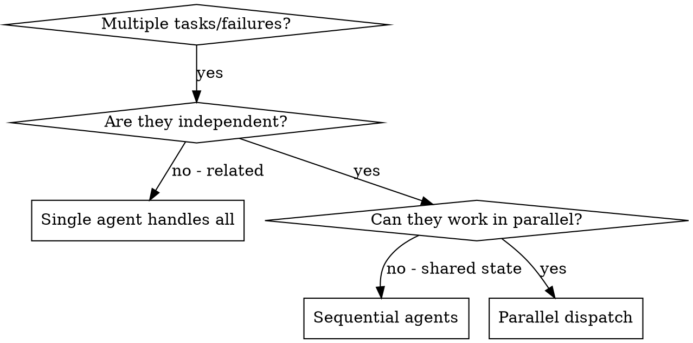

# Dispatching Parallel Agents

## Overview

Delegate independent tasks to specialized agents with isolated context. Each agent receives only what it needs — no session history — keeping them focused and results verifiable. Parallel dispatch turns N sequential investigations into 1 concurrent round.

## When to Use

**Use when:** 2+ test files failing with different root causes; multiple subsystems broken independently; each problem can be understood without context from others.

**Don't use when:** failures are related (fix one might fix others); agents would modify the same files; need to understand full system state first.

## Quick Reference

Safe to parallelize:
- Tasks touching different source files
- Tasks touching different test files
- Tasks with no shared output dependencies

NOT safe to parallelize:
- Tasks modifying the same file
- Tasks where one depends on another's output
- Exploratory debugging (root cause unknown)

After agents return: review each summary → check for conflicts → run full suite → integrate.

See [reference.md](reference.md) for the full dispatch pattern, agent prompt template, real worked example, and verification procedure.
