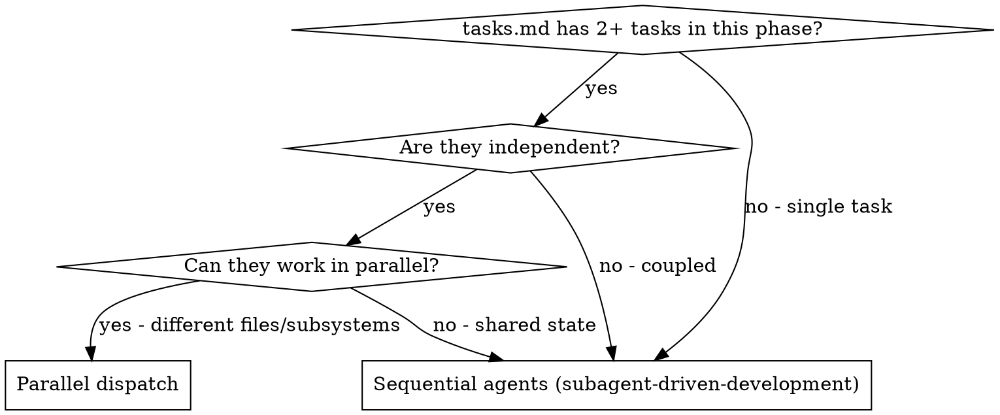

<SUBAGENT-STOP>
If you were dispatched as a subagent to execute a specific task, skip this skill.
</SUBAGENT-STOP>

# Dispatching Parallel Agents

## Overview

Delegate independent tasks to specialized agents with isolated context. Each agent receives only what it needs — no session history — keeping them focused and results verifiable. Parallel dispatch turns N sequential tasks into 1 concurrent round.

In SDD, this skill is invoked from within `sdd-superpowers:sdd-execute` when a task group in `tasks.md` has 2+ independent tasks that can be built concurrently without shared state.

## When to Use

**Use when:** A phase in `tasks.md` has 2+ tasks touching different files or subsystems with no shared output dependencies.

**Don't use when:** tasks are coupled (one depends on another's output); tasks modify the same files; only one task remains in the phase.

## Quick Reference

Safe to parallelize:
- Tasks touching different source files
- Tasks touching different test files
- Tasks with no shared output dependencies

NOT safe to parallelize:
- Tasks modifying the same file
- Tasks where one depends on another's output
- Exploratory debugging (root cause unknown)

After agents return: review each summary → check for conflicts → spec compliance review per task (spec-reviewer-prompt.md) → code quality review per task (requesting-code-review) → run full suite → mark tasks complete.

See [reference.md](reference.md) for the full dispatch pattern, agent prompt template, worked example, and post-dispatch review procedure.

## Integration

**Invoked from:**
- `sdd-superpowers:sdd-execute` — when a task group has 2+ independent tasks

**Each dispatched agent must use:**
- `sdd-superpowers:test-driven-development` — write failing test first, then implement
- `sdd-superpowers:using-git` — commit with proper convention

**After all parallel agents return:**
- Run spec compliance review per task — dispatch using `spec-reviewer-prompt.md` from `sdd-superpowers:subagent-driven-development`
- Run code quality review per task — dispatch using `sdd-superpowers:requesting-code-review` (only after spec compliance passes)
- Fix issues with `sdd-superpowers:receiving-code-review` if reviews fail
- Mark tasks complete in TodoWrite
- Continue to next phase with `sdd-superpowers:sdd-execute`
