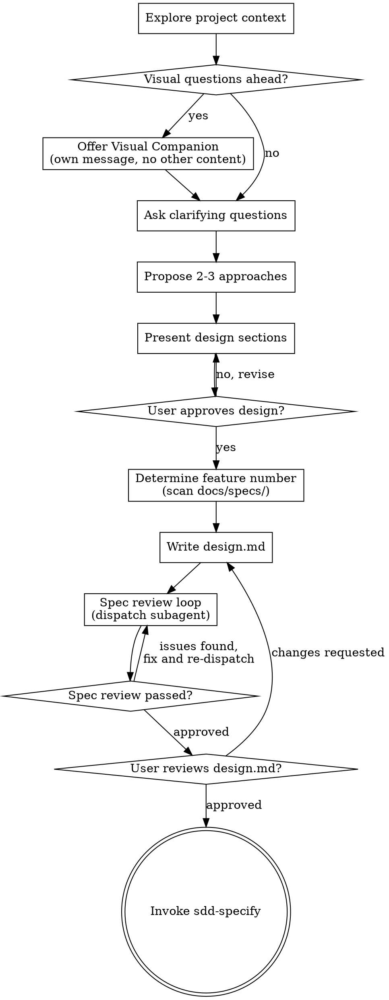

# SDD Brainstorm: Full Process Reference

> Complete brainstorm procedure, design document template, spec review loop, and visual companion guide. See [SKILL.md](SKILL.md) for the summary.

## Full Checklist

Complete these in order:

1. **Explore project context** — check `docs/specs/`, docs, recent commits
2. **Offer visual companion** (if topic involves UI/layout questions) — its own message, not combined with a question
3. **Ask clarifying questions** — one at a time, understand purpose/constraints/success criteria
4. **Propose 2-3 approaches** — with trade-offs and your recommendation
5. **Present design** — in sections, get user approval after each section
6. **Determine feature number** — scan `docs/specs/` for next available NNN
7. **Write design doc** — save to `docs/specs/NNN-<feature-slug>/design.md` after user approves design
8. **Spec review loop** — dispatch spec-document-reviewer subagent; fix issues and re-dispatch until approved (max 3 iterations, then surface to human)
9. **User reviews written design** — ask user to review before proceeding
10. **Transition** — invoke `sdd-specify` with the design doc path

## Process Flow



**The terminal state is invoking `sdd-specify`.** Do NOT invoke `sdd-plan`, `sdd-tasks`, `sdd-execute`, or any other skill. `sdd-specify` is the only next step.

## The Process

### Understanding the idea

- Check `docs/specs/` first — are there existing features this relates to or overlaps with?
- Before asking detailed questions, assess scope: if the request describes multiple independent subsystems (e.g., "build a platform with auth, billing, and notifications"), flag this immediately and help decompose before brainstorming any single piece.
- If the project is too large, help decompose: what are the independent pieces, how do they relate, what order should they be built? Each piece gets its own `sdd-brainstorm` → `sdd-specify` cycle.
- For appropriately scoped ideas, ask clarifying questions one at a time
- Prefer multiple-choice questions when possible
- Only one question per message
- Focus on: purpose, constraints, success criteria, who the users are

### Exploring approaches

- Propose 2-3 different approaches with trade-offs
- Lead with your recommendation and explain why
- Be concrete — name specific technologies, patterns, or architectural choices where relevant
- YAGNI ruthlessly: remove unrequested features from all proposed approaches

### Presenting the design

- Once you understand what's being built, present the design in sections
- Scale each section to its complexity
- Ask after each section whether it looks right
- Cover: the core approach, key design decisions, what's explicitly out of scope

### Design for isolation and clarity

- Break the system into units with one clear purpose each
- Can someone understand what a unit does without reading its internals?
- Can you change the internals without breaking consumers?
- If not, the boundaries need work

## Writing the Design Document

After user approves the design:

1. Scan `docs/specs/` for the next available feature number (NNN)
2. Create directory: `docs/specs/NNN-<feature-slug>/`
3. Write `docs/specs/NNN-<feature-slug>/design.md` with this exact structure:

```markdown
# Design: <Feature Name>

**Date:** YYYY-MM-DD
**Feature:** NNN-<feature-slug>

## Problem

<What problem this solves and who experiences it.>

## Chosen Approach

<The approach selected from the options explored, written out concretely.>

## Trade-offs & Rationale

<Why this approach was chosen over the alternatives. What was given up.>

## Key Design Decisions

<Specific decisions made during brainstorming that constrain implementation.>

## Out of Scope

<What was explicitly discussed and excluded.>
```

## Spec Review Loop

After writing `design.md`, dispatch the spec-document-reviewer subagent:

See `spec-document-reviewer-prompt.md` in this directory for the dispatch template.

- If **Issues Found**: fix, re-dispatch, repeat until Approved
- If loop exceeds **3 iterations**: surface to human for guidance — do not keep looping
- If **Approved**: proceed to user review gate

## User Review Gate

After the spec review loop passes:

> "Design written and saved to `docs/specs/NNN-feature-slug/design.md`. Please review it — does this capture what you want to build? Any changes before we move to spec?"

Wait for the user's response. If they request changes: update `design.md`, re-run the spec review loop. Only proceed once the user explicitly approves.

## Transition to sdd-specify

After user approval:

> "Design approved. Invoking `sdd-specify` with this design as input — it will formalize `design.md` into a complete `spec.md` without re-asking the questions we've already answered."

**REQUIRED NEXT SKILL:** Use `sdd-specify`. Pass the path `docs/specs/NNN-<feature-slug>/design.md`.

## Visual Companion

A browser-based companion for showing mockups, diagrams, and visual options.

**Offering the companion:** When you anticipate visual questions (mockups, layouts, architecture diagrams), offer it once:

> "Some of what we're working on might be easier to explain if I can show it in a browser — mockups, diagrams, layout comparisons. Want to try it? (Requires opening a local URL)"

**This offer MUST be its own message.** Do not combine with clarifying questions or any other content. Wait for the user's response before continuing.

**Per-question decision:** Even after the user accepts, decide FOR EACH QUESTION whether to use the browser or the terminal:
- **Use the browser** for visual content: mockups, wireframes, layout comparisons, architecture diagrams
- **Use the terminal** for text content: requirements questions, conceptual A/B choices, tradeoff lists

If they agree, read `visual-companion.md` in this directory before proceeding.

## Key Principles

- **One question at a time** — never multiple
- **Multiple choice preferred** — easier than open-ended when space is bounded
- **YAGNI ruthlessly** — remove unrequested features from all designs
- **Explore alternatives** — always propose 2-3 approaches before settling
- **Incremental validation** — present design in sections, get approval
- **Scope decomposition first** — never brainstorm a multi-subsystem idea without decomposing
