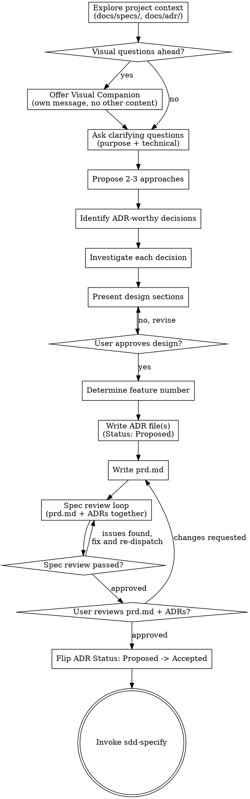

# SDD Brainstorm: Full Process Reference

> Complete brainstorm procedure — idea exploration, technical investigation, ADR and PRD templates, spec review loop, and visual companion guide. See [SKILL.md](SKILL.md) for the summary.

## Step 0: Load Steering Context

Scan `.claude/memory/steering/` for `.md` files whose `loaded-by` frontmatter includes `sdd-brainstorm`. Read each matched file and incorporate its content as context before producing any user-facing output. Loading is silent — no announcement to the user.

If `.claude/memory/steering/` does not exist, or no files contain `sdd-brainstorm` in `loaded-by`, proceed without change.

Rescan on every invocation — custom files added after init are discovered automatically.

## Full Checklist

Complete these in order:

1. **Explore project context** — check `docs/specs/`, `docs/adr/`, docs, recent commits
2. **Offer visual companion** (if topic involves UI/layout questions) — its own message, not combined with a question
3. **Ask clarifying questions** — one at a time; cover purpose/constraints/success criteria AND technical requirements (performance, security, integrations, NFRs)
4. **Propose 2-3 approaches** — with trade-offs and your recommendation
5. **Identify ADR-worthy decisions** — see "Which Decisions Get an ADR" below
6. **Investigate each ADR-worthy decision** — see "Investigating a Decision" below
7. **Present design** — in sections, get user approval after each section
8. **Determine feature number** — scan `docs/specs/` for next available NNN
9. **Write ADR file(s)** — `docs/adr/<NNN>-<slug>.md`, `Status: Proposed`, one per ADR-worthy decision
10. **Write `prd.md`** — save to `docs/specs/NNN-<feature-slug>/prd.md`, linking to each ADR
11. **Spec review loop** — dispatch spec-document-reviewer subagent against `prd.md` and all its linked ADRs together; fix issues and re-dispatch until approved (max 3 iterations, then surface to human)
12. **User reviews `prd.md` and ADRs**
13. **On approval** — flip each new ADR's `Status` from `Proposed` to `Accepted`
14. **Transition** — invoke `sdd-superpowers:sdd-specify` with the `prd.md` path

## Process Flow

```dot
digraph sdd_brainstorm {
    "Explore project context\n(docs/specs/, docs/adr/)" [shape=box];
    "Visual questions ahead?" [shape=diamond];
    "Offer Visual Companion\n(own message, no other content)" [shape=box];
    "Ask clarifying questions\n(purpose + technical)" [shape=box];
    "Propose 2-3 approaches" [shape=box];
    "Identify ADR-worthy decisions" [shape=box];
    "Investigate each decision" [shape=box];
    "Present design sections" [shape=box];
    "User approves design?" [shape=diamond];
    "Determine feature number" [shape=box];
    "Write ADR file(s)\n(Status: Proposed)" [shape=box];
    "Write prd.md" [shape=box];
    "Spec review loop\n(prd.md + ADRs together)" [shape=box];
    "Spec review passed?" [shape=diamond];
    "User reviews prd.md + ADRs?" [shape=diamond];
    "Flip ADR Status: Proposed -> Accepted" [shape=box];
    "Invoke sdd-specify" [shape=doublecircle];

    "Explore project context\n(docs/specs/, docs/adr/)" -> "Visual questions ahead?";
    "Visual questions ahead?" -> "Offer Visual Companion\n(own message, no other content)" [label="yes"];
    "Visual questions ahead?" -> "Ask clarifying questions\n(purpose + technical)" [label="no"];
    "Offer Visual Companion\n(own message, no other content)" -> "Ask clarifying questions\n(purpose + technical)";
    "Ask clarifying questions\n(purpose + technical)" -> "Propose 2-3 approaches";
    "Propose 2-3 approaches" -> "Identify ADR-worthy decisions";
    "Identify ADR-worthy decisions" -> "Investigate each decision";
    "Investigate each decision" -> "Present design sections";
    "Present design sections" -> "User approves design?";
    "User approves design?" -> "Present design sections" [label="no, revise"];
    "User approves design?" -> "Determine feature number" [label="yes"];
    "Determine feature number" -> "Write ADR file(s)\n(Status: Proposed)";
    "Write ADR file(s)\n(Status: Proposed)" -> "Write prd.md";
    "Write prd.md" -> "Spec review loop\n(prd.md + ADRs together)";
    "Spec review loop\n(prd.md + ADRs together)" -> "Spec review passed?";
    "Spec review passed?" -> "Spec review loop\n(prd.md + ADRs together)" [label="issues found,\nfix and re-dispatch"];
    "Spec review passed?" -> "User reviews prd.md + ADRs?" [label="approved"];
    "User reviews prd.md + ADRs?" -> "Write prd.md" [label="changes requested"];
    "User reviews prd.md + ADRs?" -> "Flip ADR Status: Proposed -> Accepted" [label="approved"];
    "Flip ADR Status: Proposed -> Accepted" -> "Invoke sdd-specify";
}
```

**The terminal state is invoking `sdd-superpowers:sdd-specify`.** Do NOT invoke `sdd-superpowers:sdd-plan`, `sdd-superpowers:sdd-execute`, or any other skill. `sdd-superpowers:sdd-specify` is the only next step.

## The Process

### Understanding the idea

- Check `docs/specs/` and `docs/adr/` first — are there existing features or decisions this relates to or overlaps with?
- Before asking detailed questions, assess scope: if the request describes multiple independent subsystems (e.g., "build a platform with auth, billing, and notifications"), flag this immediately and help decompose before brainstorming any single piece.
- If the project is too large, help decompose: what are the independent pieces, how do they relate, what order should they be built? Each piece gets its own `sdd-superpowers:sdd-brainstorm` → `sdd-superpowers:sdd-specify` cycle.
- For appropriately scoped ideas, ask clarifying questions one at a time
- Prefer multiple-choice questions when possible
- Only one question per message
- Focus on: purpose, constraints, success criteria, who the users are, AND technical constraints — performance targets, security/compliance requirements, external integrations

### Exploring approaches

- Propose 2-3 different approaches with trade-offs
- Lead with your recommendation and explain why
- Be concrete — name specific technologies, patterns, or architectural choices where relevant
- YAGNI ruthlessly: remove unrequested features from all proposed approaches

### Which Decisions Get an ADR

A decision warrants its own ADR file when at least one of these is true:

- **Hard to reverse** — migrating away later costs real time (a database, a framework, an auth provider)
- **Genuinely competing options** — real trade-offs exist, not a single obvious answer
- **Durable value** — a later feature will plausibly need to know why this choice was made

Trivial or obvious choices (a dependency already used everywhere in the project, a naming convention, a one-line config default) are mentioned inline in `prd.md`'s narrative — no ADR file. When a decision does NOT rise to ADR level, say so out loud with the reasoning, so the user can override.

### Investigating a Decision

For each ADR-worthy decision, investigate before writing the ADR:

**Library/framework comparisons:**
- List top 2-4 candidates with their trade-offs
- Note: license, maturity, maintenance status, community size
- Note: specific compatibility with the project's existing stack
- Note: performance benchmarks if available
- Make a clear recommendation with rationale

**Performance analysis:**
- Identify the performance-critical path for the feature
- Estimate load characteristics (requests/sec, data volume, concurrency)
- Identify potential bottlenecks before they become problems
- Recommend caching, indexing, or architectural patterns if needed

**Security review:**
- Identify threat vectors relevant to this feature
- Check OWASP guidance for the feature type
- Note authentication/authorization requirements
- Flag data sensitivity and relevant compliance requirements (GDPR, HIPAA, etc.)

**Integration research:**
- Document the external API's constraints (rate limits, auth, data formats)
- Note failure modes and how to handle them
- Identify if an SDK exists vs. raw HTTP needed

**Quality standards for every investigation:**
- **Cite evidence** — "It's popular" is not sufficient; "It has native TypeScript support and we're already using it for X" is
- **Acknowledge uncertainty** — if no reliable benchmark data exists, say so and recommend load testing after implementation
- **Stay grounded in the idea being brainstormed** — don't investigate hypothetical future requirements
- **Avoid analysis paralysis** — list trade-offs but commit to a recommendation for each decision

### Presenting the design

- Once you understand what's being built, present the design in sections
- Scale each section to its complexity
- Ask after each section whether it looks right
- Cover: the core approach, key technical decisions (with your recommendation), what's explicitly out of scope

### Design for isolation and clarity

- Break the system into units with one clear purpose each
- Can someone understand what a unit does without reading its internals?
- Can you change the internals without breaking consumers?
- If not, the boundaries need work

## Writing ADR Files

After the user approves a decision during design presentation:

1. Choose a kebab-case `<slug>` naming the decision topic (e.g. `choose-search-backend`)
2. Create `docs/adr/` if it doesn't exist
3. Write `docs/adr/<NNN>-<slug>.md` using [adr-template.md](adr-template.md), with `Status: Proposed`
4. If this decision supersedes a prior ADR, set the OLD ADR's `Status` to `Superseded by <NNN-slug>` — never delete a prior ADR

`NNN` is the current feature's spec number (same number `prd.md` will use), so an ADR can always be traced back to the feature that produced it. ADRs persist across features — they are not deleted when the originating feature is later changed.

**Structural compliance check (before dispatching the spec reviewer):** Does each ADR contain, in order: header metadata (Status, Date, Feature) → Context → Options Considered → Decision → Consequences?

## Writing the PRD

After all ADRs for this brainstorm are written:

1. Scan `docs/specs/` for the next available feature number (NNN) — reuse the same number used for this session's ADRs
2. Create directory: `docs/specs/NNN-<feature-slug>/`
3. Write `docs/specs/NNN-<feature-slug>/prd.md` using [template.md](template.md), linking to each ADR by path with a one-line summary of what was decided

**Structural compliance check (before dispatching the spec reviewer):** Does the written `prd.md` contain all required sections from `template.md` in order (header metadata → Problem → Users & Context → Goals → Non-Goals → Success Criteria → Architecture Decisions → Out of Scope)? Fix any missing or reordered sections before dispatching the spec-document-reviewer subagent.

## Spec Review Loop

After writing `prd.md` and its ADRs, dispatch the spec-document-reviewer subagent:

See `spec-document-reviewer-prompt.md` in this directory for the dispatch template. One dispatch reviews `prd.md` and ALL of its linked ADRs together, in a single pass.

- If **Issues Found**: fix, re-dispatch, repeat until Approved
- If loop exceeds **3 iterations**: surface to human for guidance — do not keep looping
- If **Approved**: proceed to user review gate

## User Review Gate

After the spec review loop passes:

> "PRD written and saved to `docs/specs/NNN-feature-slug/prd.md`, with N architecture decision(s) recorded in `docs/adr/`. Please review — does this capture what you want to build and how? Any changes before we move to spec?"

Wait for the user's response. If they request changes: update `prd.md` and/or the affected ADR(s), re-run the spec review loop. Only proceed once the user explicitly approves.

On approval, flip each new ADR's `Status` from `Proposed` to `Accepted`.

## Transition to sdd-specify

After user approval:

> "PRD and architecture decisions approved. Invoking `sdd-superpowers:sdd-specify` with `prd.md` as input — it will formalize it into a complete `spec.md` without re-asking the questions we've already answered."

**REQUIRED NEXT SKILL:** Use `sdd-superpowers:sdd-specify`. Pass the path `docs/specs/NNN-<feature-slug>/prd.md`.

## Visual Companion

A browser-based companion for showing mockups, diagrams, and visual options.

**Offering the companion:** When you anticipate visual questions (mockups, layouts, architecture diagrams), offer it once:

> "Some of what we're working on might be easier to explain if I can show it in a browser — mockups, diagrams, layout comparisons. Want to try it? (Requires opening a local URL)"

**This offer MUST be its own message.** Do not combine with clarifying questions or any other content. Wait for the user's response before continuing.

**Per-question decision:** Even after the user accepts, decide FOR EACH QUESTION whether to use the browser or the terminal:
- **Use the browser** for visual content: mockups, wireframes, layout comparisons, architecture diagrams
- **Use the terminal** for text content: requirements questions, conceptual A/B choices, tradeoff lists

If they agree, read `visual-companion.md` in this directory before proceeding.

## Key Principles

- **One question at a time** — never multiple
- **Multiple choice preferred** — easier than open-ended when space is bounded
- **YAGNI ruthlessly** — remove unrequested features from all designs
- **Explore alternatives** — always propose 2-3 approaches before settling
- **Incremental validation** — present design in sections, get approval
- **Scope decomposition first** — never brainstorm a multi-subsystem idea without decomposing
- **ADR discipline** — only a decision that's hard to reverse or genuinely contested gets a durable record; everything else stays inline in the PRD
