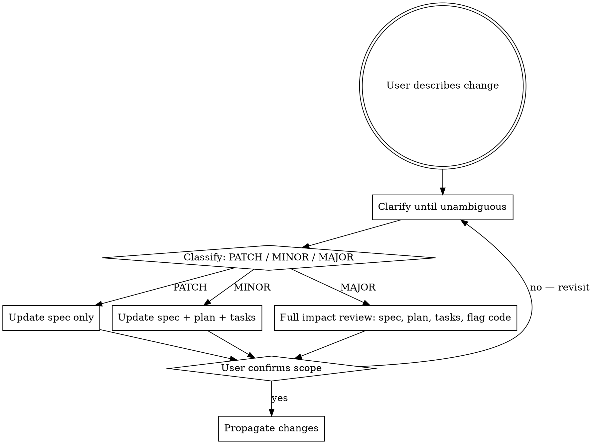

# SDD: Spec Update

**Announce at start:** "I'm using the sdd-spec-update skill to assess and integrate this change."

## Overview

Safely integrate mid-flight changes into a running SDD workflow. Changes are classified by their downstream impact using a spec versioning scheme (MAJOR.MINOR.PATCH), and only the artifacts actually affected are updated. The spec remains the source of truth — all downstream documents derive from it.

<examples>
<example>
<context>User says "we decided to drop the CSV export requirement — let's just remove it."</context>
<correct>Invoke sdd-spec-update. Assess downstream impact, assign a version bump, update spec.md, and propagate changes to plan and tasks before removing any code.</correct>
<incorrect>Delete the CSV export code and remove the relevant tasks from tasks.md without versioning the spec — the spec and implementation are now out of sync with no audit trail.</incorrect>
</example>
</examples>

<HARD-GATE>
Do NOT update any downstream artifact (plan, tasks, code) until:
1. The change is fully understood — no ambiguity remains
2. A version bump has been assigned and justified
3. The user has explicitly confirmed the impact scope
</HARD-GATE>

## When to Use

- User describes a change to an existing, approved spec
- User adds a requirement not captured in the current spec
- User discovers a requirement was wrong, missing, or misunderstood
- User asks "can we also add X?" or "actually, I want Y instead of Z"
- NOT for brand-new features with no existing spec — use `sdd-superpowers:sdd-specify`
- NOT for implementation bugs — use `sdd-superpowers:systematic-debugging`

## Spec Versioning (MAJOR.MINOR.PATCH)

| Bump | Triggers | Downstream Impact |
|------|----------|------------------|
| **PATCH** `0.0.x` | Clarification, wording fix, missing detail, example added — no behavior change | Spec only |
| **MINOR** `0.x.0` | New requirement, new user story, new non-breaking behavior, scope addition | Spec + affected plan phases + affected tasks |
| **MAJOR** `x.0.0` | Removes or rewrites an existing requirement, changes architecture, breaks contracts, contradicts approved design | Spec + full plan review + full task review + flag in-progress code |

Every spec starts at `1.0.0` when approved. Add a `Version:` field to the spec frontmatter.

## Quick Reference

## Clarification First

Ask clarifying questions **before classifying** the change. One question at a time:

1. **What specifically changes?** — Old behavior vs. new behavior
2. **Why?** — What user need or discovery drove this?
3. **Does this replace or extend?** — Override an existing requirement, or add alongside it?
4. **Are there constraints?** — Performance, security, compatibility concerns
5. **What's the boundary?** — What explicitly does NOT change?

Stop when the new requirement could be written as a testable acceptance criterion.

## Common Mistakes

- Updating plan/tasks without re-reading the current spec first
- Treating "add X" as always MINOR — sometimes X contradicts an existing requirement (MAJOR)
- Skipping clarification when the change "seems obvious"
- Updating tasks but not the spec — spec is always updated first
- Forgetting to flag in-progress code during a MAJOR bump

## Integration

Required sub-skills:

| When | Sub-skill |
|------|-----------|
| Committing versioned spec, plan, and tasks after propagation | `sdd-superpowers:using-git` |

## Execution Handoff

After propagating changes:

> "Spec updated to vX.Y.Z. [List updated artifacts]. Resuming from [next unaffected task / re-planning needed]. Run `sdd-superpowers:sdd-execute` (or `sdd-superpowers:sdd-plan`) to continue."

See [reference.md](reference.md) for the full classification guide, per-artifact update procedures, spec version header format, and task resume rules.

## Constraints

- Does NOT update any downstream artifact (plan, tasks, code) until the spec change is fully understood, a version bump is assigned, and the user has explicitly confirmed the impact scope
- Does NOT make scope changes without an impact assessment on existing plan and tasks

## Error Handling

- **Change scope is unclear**: Ask one clarifying question before assigning a version bump — never assume the extent of a change.
- **Change conflicts with an already-completed task**: Surface the conflict to the user; offer options (revert the task, update the spec to reflect what was built, or add a new task to align).
- **User requests gate bypass**: The gate is "no downstream changes before spec is versioned." Explain that un-versioned spec changes break traceability. Offer to do the version bump first — it is a one-line change.
