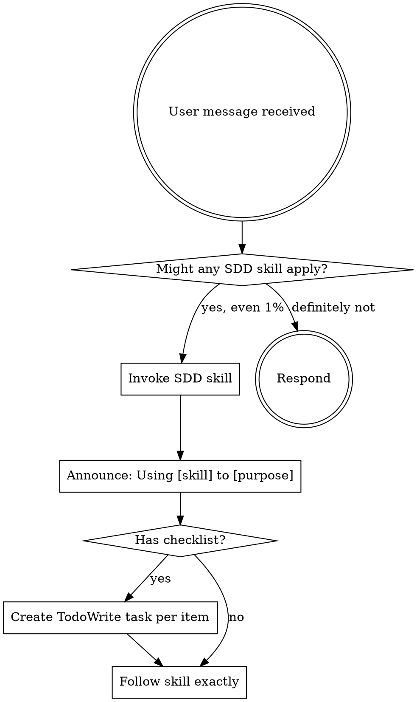

<SUBAGENT-STOP>
If you were dispatched as a subagent to execute a specific task, skip this skill.
</SUBAGENT-STOP>

<EXTREMELY-IMPORTANT>
If you think there is even a 1% chance an SDD skill might apply to what you are doing, you ABSOLUTELY MUST invoke it BEFORE any response or action — including clarifying questions.

IF A SKILL APPLIES TO YOUR TASK, YOU DO NOT HAVE A CHOICE. YOU MUST USE IT.

This is not negotiable. This is not optional. You cannot rationalize your way out of this.
</EXTREMELY-IMPORTANT>

# SDD Workflow

## Overview

Entry point for SDD. When a skill might apply, invoke it before acting — non-negotiable.

## When to Use

- Every SDD conversation, from the start
- When the next step after a skill is unclear
- NOT for non-SDD repositories

## Instruction Priority

1. **User's explicit instructions** (CLAUDE.md, direct requests) — highest priority
2. **SDD skills** — govern the development workflow
3. **Default behavior** — lowest priority

User instructions say **WHAT** to build, not HOW. "Add X" or "Fix Y" doesn't mean skip the SDD workflow.

## Skill Invocation Flow



Always announce before invoking: `"I'm using [skill-name] to [purpose]."` — gives the user a chance to redirect.

When the invoked skill has a checklist, create a **TodoWrite task per checklist item** before starting work.

## Quick Reference

| Situation | Invoke |
|-----------|--------|
| Fuzzy or exploratory idea | `sdd-superpowers:sdd-brainstorm` |
| Clear idea | `sdd-superpowers:sdd-specify` |
| Unresolved tech choices | `sdd-superpowers:sdd-research` |
| Spec exists | `sdd-superpowers:sdd-plan` |
| Plan exists | `sdd-superpowers:sdd-tasks` |
| Tasks exist | `sdd-superpowers:sdd-execute` |
| **Change or addition to an approved spec** | `sdd-superpowers:sdd-spec-update` |
| **All tasks complete** (post-implementation) | `sdd-superpowers:sdd-review` ← required before merge |
| Spec completeness check (pre-plan) | `sdd-superpowers:sdd-review` |
| Task fails | `sdd-superpowers:systematic-debugging` |
| About to claim done | `sdd-superpowers:verification-before-completion` |
| Merge decision | `sdd-superpowers:finishing-a-development-branch` |
| Any git operation (branch, commit, convention) | `sdd-superpowers:using-git` |
| Phase boundary during execution | `sdd-superpowers:requesting-code-review` |
| Implementing fixes after review feedback | `sdd-superpowers:receiving-code-review` |
| Dispatching 2+ independent tasks concurrently | `sdd-superpowers:dispatching-parallel-agents` |
| Executing tasks in current session with subagents | `sdd-superpowers:subagent-driven-development` |
| Each implementer subagent (dispatched from subagent-driven-development) | `sdd-superpowers:test-driven-development` |

```
NO PLAN without an approved spec
NO TASKS without a plan
NO CODE without a prior failing test
NO COMPLETION CLAIM without fresh verification evidence
```

## Skill Types

**Rigid** (TDD, debugging, verification-before-completion): Follow exactly. Don't adapt away the discipline.

**Flexible** (brainstorm, specify, plan): Adapt principles to context and project needs.

The skill itself tells you which type it is.

## Common Mistakes

- Skipping `sdd-superpowers:sdd-brainstorm` — assess fuzziness first
- Coding without a spec — `sdd-superpowers:sdd-specify` first
- Updating tasks or plan without running `sdd-superpowers:sdd-spec-update` when user requests a change — spec must be versioned first
- Claiming done without evidence — `sdd-superpowers:verification-before-completion`
- Skipping `sdd-superpowers:sdd-review` after implementation — it is a required step before `finishing-a-development-branch`
- Invoking this skill inside a subagent task — subagents skip this skill entirely

Full routing rules and red flags: See [routing.md](routing.md)
