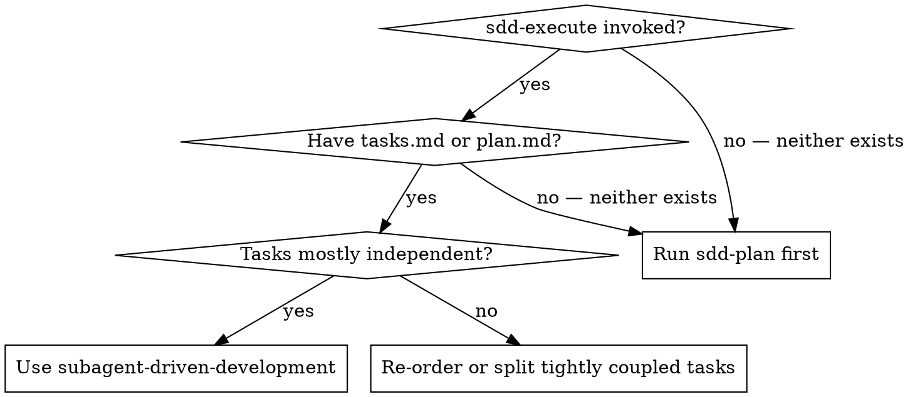
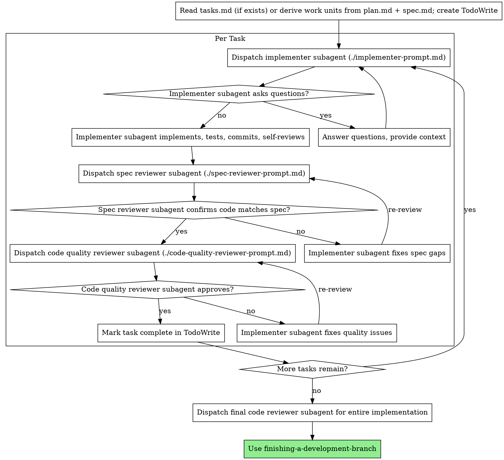

# Subagent-Driven Development

## Overview

Execute implementation plans by dispatching a fresh subagent per task, with spec-compliance and code-quality review after each.

<examples>
<example>
<context>tasks.md has 8 tasks where task 4 depends on output from task 3, and task 7 depends on task 6.</context>
<correct>Dispatch tasks 1–2 in parallel if independent, then task 3 sequentially, then task 4 after task 3 is confirmed complete — respecting the dependency chain throughout.</correct>
<incorrect>Dispatch all 8 tasks concurrently — dependent tasks will fail or produce incorrect results when their prerequisites are not yet complete.</incorrect>
</example>
</examples>

Execute plan by dispatching fresh subagent per task, with two-stage review after each: spec compliance review first, then code quality review.

**Why subagents:** You delegate tasks to specialized agents with isolated context. By precisely crafting their instructions and context, you ensure they stay focused and succeed at their task. They should never inherit your session's context or history — you construct exactly what they need. This also preserves your own context for coordination work.

**Core principle:** Fresh subagent per task + two-stage review (spec then quality) = high quality, fast iteration

## When to Use



**Position in the SDD workflow:**

```
sdd-execute (controller) ← invokes this skill
  └─ subagent-driven-development (orchestrator) ← YOU ARE HERE
       └─ implementer subagent (one per work unit)
            └─ test-driven-development (inside each implementer)
```

**Role:** This skill is invoked by `sdd-execute` (the controller) to orchestrate session-based execution. It is not a peer of `sdd-execute` — `sdd-execute` calls it. Users never invoke this skill directly.

**How it works:**
- Reads `tasks.md` (task-driven mode) or derives work units from `plan.md` + `spec.md` (plan-driven mode)
- Fresh subagent per work unit (no context pollution)
- Two-stage review after each unit: spec compliance first, then code quality
- Faster iteration (no human-in-loop between units)

## The Process



## Model Selection

**Implementer subagents:** omit the `model` param — they inherit the calling session's model. Implementation is the highest-stakes role (writes the code that ships), so don't downgrade it to save cost.

**Spec-reviewer and code-quality-reviewer subagents:** may use a cheaper model. Their job is narrower — checking compliance against a known spec or known quality criteria, not open-ended building — so a fast/cheap model is usually sufficient.

**Exception — escalation:** If an implementer reports BLOCKED because the task requires more reasoning than it's getting, re-dispatch with an explicit, more capable `model` override (see Handling Implementer Status below).

## Handling Implementer Status

Implementer subagents report one of four statuses. Handle each appropriately:

**DONE:** Proceed to spec compliance review.

**DONE_WITH_CONCERNS:** The implementer completed the work but flagged doubts. Read the concerns before proceeding. If the concerns are about correctness or scope, address them before review. If they're observations (e.g., "this file is getting large"), note them and proceed to review.

**NEEDS_CONTEXT:** The implementer needs information that wasn't provided. Provide the missing context and re-dispatch.

**BLOCKED:** The implementer cannot complete the task. Assess the blocker:
1. If it's a context problem, provide more context and re-dispatch with the same model
2. If the task requires more reasoning, re-dispatch with a more capable model
3. If the task is too large, break it into smaller pieces
4. If the plan itself is wrong, escalate to the human

**Never** ignore an escalation or force the same model to retry without changes. If the implementer said it's stuck, something needs to change.

## SDD Source Files

Before dispatching any subagent, read these files once and keep the content in context:

| File | Purpose |
|------|---------|
| `docs/specs/NNN-feature/tasks.md` | Primary task source when present — extract full text per task (task-driven mode) |
| `docs/specs/NNN-feature/plan.md` | Primary source when tasks.md is absent — derive work units from sections (plan-driven mode); always include as implementer context |
| `docs/specs/NNN-feature/spec.md` | Authoritative spec — pass to spec reviewer as ground truth |

Never make subagents read these files themselves. Extract and inject the relevant content into each prompt.

## Prompt Templates

- `./implementer-prompt.md` - Dispatch implementer subagent
- `./spec-reviewer-prompt.md` - Dispatch spec compliance reviewer subagent
- `./code-quality-reviewer-prompt.md` - Dispatch code quality reviewer subagent

## Example Workflow

```
You: I'm using sdd-superpowers:subagent-driven-development to execute this plan.

[Read docs/specs/NNN-feature/tasks.md if it exists; otherwise read plan.md + spec.md and derive work units]
[Extract all work units with full text and context]
[Create TodoWrite with all work units]

Task 1: Hook installation script

[Get Task 1 text and context (already extracted)]
[Dispatch implementation subagent with full task text + context]

Implementer: "Before I begin - should the hook be installed at user or system level?"

You: "User level (~/.config/superpowers/hooks/)"

Implementer: "Got it. Implementing now..."
[Later] Implementer:
  - Implemented install-hook command
  - Added tests, 5/5 passing
  - Self-review: Found I missed --force flag, added it
  - Committed

[Dispatch spec compliance reviewer]
Spec reviewer: ✅ Spec compliant - all requirements met, nothing extra

[Get git SHAs, dispatch code quality reviewer]
Code reviewer: Strengths: Good test coverage, clean. Issues: None. Approved.

[Mark Task 1 complete]

Task 2: Recovery modes

[Get Task 2 text and context (already extracted)]
[Dispatch implementation subagent with full task text + context]

Implementer: [No questions, proceeds]
Implementer:
  - Added verify/repair modes
  - 8/8 tests passing
  - Self-review: All good
  - Committed

[Dispatch spec compliance reviewer]
Spec reviewer: ❌ Issues:
  - Missing: Progress reporting (spec says "report every 100 items")
  - Extra: Added --json flag (not requested)

[Implementer fixes issues]
Implementer: Removed --json flag, added progress reporting

[Spec reviewer reviews again]
Spec reviewer: ✅ Spec compliant now

[Dispatch code quality reviewer]
Code reviewer: Strengths: Solid. Issues (Important): Magic number (100)

[Implementer fixes]
Implementer: Extracted PROGRESS_INTERVAL constant

[Code reviewer reviews again]
Code reviewer: ✅ Approved

[Mark Task 2 complete]

...

[After all tasks]
[Dispatch final code-reviewer]
Final reviewer: All requirements met, ready to merge

Done!
```

## Advantages

**vs. Manual execution:**
- Subagents follow TDD naturally
- Fresh context per task (no confusion)
- Parallel-safe (subagents don't interfere)
- Subagent can ask questions (before AND during work)

**vs. Executing Plans:**
- Same session (no handoff)
- Continuous progress (no waiting)
- Review checkpoints automatic

**Efficiency gains:**
- No file reading overhead (controller provides full text)
- Controller curates exactly what context is needed
- Subagent gets complete information upfront
- Questions surfaced before work begins (not after)

**Quality gates:**
- Self-review catches issues before handoff
- Two-stage review: spec compliance, then code quality
- Review loops ensure fixes actually work
- Spec compliance prevents over/under-building
- Code quality ensures implementation is well-built

**Cost:**
- More subagent invocations (implementer + 2 reviewers per task)
- Controller does more prep work (extracting all tasks upfront)
- Review loops add iterations
- But catches issues early (cheaper than debugging later)

## Red Flags

**Never:**
- Start implementation on main/master branch without explicit user consent
- Skip reviews (spec compliance OR code quality)
- Proceed with unfixed issues
- Dispatch multiple implementation subagents in parallel (conflicts)
- Make subagent read plan file (provide full text instead)
- Skip scene-setting context (subagent needs to understand where task fits)
- Ignore subagent questions (answer before letting them proceed)
- Accept "close enough" on spec compliance (spec reviewer found issues = not done)
- Skip review loops (reviewer found issues = implementer fixes = review again)
- Let implementer self-review replace actual review (both are needed)
- **Start code quality review before spec compliance is ✅** (wrong order)
- Move to next task while either review has open issues

**If subagent asks questions:**
- Answer clearly and completely
- Provide additional context if needed
- Don't rush them into implementation

**If reviewer finds issues:**
- Implementer (same subagent) fixes them
- Reviewer reviews again
- Repeat until approved
- Don't skip the re-review

**If subagent fails task:**
- Dispatch fix subagent with specific instructions
- Don't try to fix manually (context pollution)

## Integration

**Invoked by:**
- `sdd-superpowers:sdd-execute` — the controller that reads `tasks.md` or `plan.md`, derives work units, and delegates orchestration to this skill

**Each implementer subagent must use:**
- `sdd-superpowers:test-driven-development` — TDD is mandated inside every implementer subagent; the controller injects this mandate into the subagent prompt

**Skills used during orchestration:**
- `sdd-superpowers:using-git` — for per-unit commits (convention validation, conflict detection)
- `sdd-superpowers:requesting-code-review` — spec-compliance and code-quality review after each unit
- `sdd-superpowers:receiving-code-review` — when a reviewer returns issues requiring fixes
- `sdd-superpowers:finishing-a-development-branch` — after all units are complete and reviewed

**Upstream (provides input to this skill):**
- `sdd-superpowers:sdd-plan` — creates `plan.md` (plan-driven mode source of truth)

## Constraints

- Does NOT dispatch tasks that have sequential dependencies concurrently
- Does NOT allow a subagent to inherit the main session's conversation history — each subagent receives only the context constructed for its specific task

## Error Handling

- **A subagent returns a failure**: Do not dispatch the next dependent task. Surface the failure to the user and decide whether to retry, fix the task definition, or debug first with systematic-debugging.
- **Tasks appear parallelizable but share a file**: Identify the shared file; execute those tasks sequentially instead.
- **User requests gate bypass**: The gate is "no concurrent dispatch for dependent tasks." Explain the failure mode. Offer to map out the dependency graph before dispatching.
